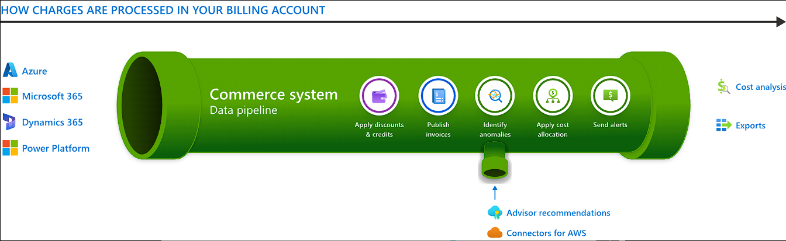
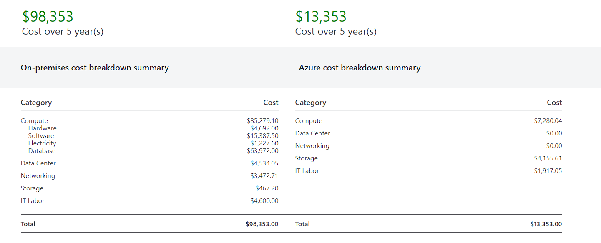
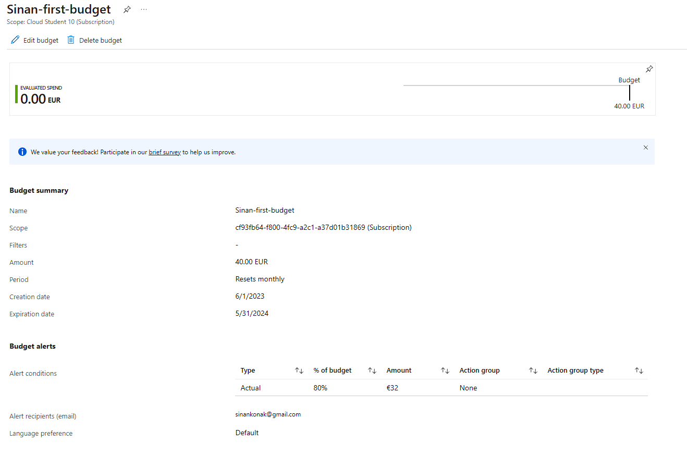

# AZ-02 - Cost Management & Billing

In this Assigment we will take a deeper dive into the concept of Cost Management and Billing on the Azure Cloud Platform.

Azure Cost Management and Billing is a powerful tool that helps businesses manage and optimize their cloud spending. It provides visibility into the financial aspects of using Azure services, enabling organizations to control and monitor their expenses in a clear and efficient manner. 

You can manage your cloud spending as an operational expense (OPEX), allowing for better budgeting and cost allocation. The tool provides detailed insights and analytics on usage and costs. The "Cost Management and Billing" tool brings together comprehensive features for cost tracking, budgeting, and forecasting. This tool allows users to monitor costs across different subscriptions, by providing visibility into resource utilization and spending patterns.

Azure Cost Management and Billing operates within the context of Azure subscriptions, which are logical containers that allow businesses to organize and manage their Azure resources. Subscriptions can be categorized into various types, such as 'Pay-as-you-go' subscription, which offers flexibility and scalability by charging based on actual resource consumption. This model eliminates the need for upfront capital expenditure and aligns costs with actual usage.


## Key-terms (In regards to Azure)


- [x] <strong>Billing</strong> -> is where you can manage your accounts, invoices, and payments. Billing is available to anyone with access to a billing account.
- [x] <strong>Microsoft Cost Management</strong> -> a suite of tools that help organizations monitor, allocate, and optimize the cost of their Microsoft Cloud workloads.
- [x] <strong>Commerce System</strong> -> a data pipeline that underpins all Microsoft commercial transactions, whether consumer or commercial.
- [x] <strong>TCO</strong> -> Total Cost of Ownership
 

**Examples of what you can do in Cost Management and Billing:**
- Report on and analyze costs in the Azure portal, Microsoft 365 admin center, or externally by exporting data.
- Monitor costs proactively with budget, anomaly, and scheduled alerts.
- Split shared costs with cost allocation rules.
- Create and organize subscriptions to customize invoices.
- Configure payment options and pay invoices.
- Manage your billing information, such as legal entity, tax information, and agreements.

Microsoft Commerce data pipeline illustrated:



**Key-Principles for success in cloud cost management:**

- [x] <strong>Planning</strong> -> Comprehensive, up-front planning allows you to tailor cloud usage to your specific business requirements. Ask yourself:
```
What business problem am I solving?
What usage patterns do I expect from my resources?
```
Your answers will help you select the offerings that are right for you. They determine the infrastructure to use and how it's used to maximize your Azure efficiency.

- [x] <strong>Visibility</strong> -> When structured well, Cost Management helps you to inform people about the Azure costs they're responsible for or for the money they spend. Azure has services designed to give you insight into where your money is spent. It helps you find resources that are underused, remove waste, and maximize cost-saving opportunities.

- [x] <strong>Accountability</strong> -> Attribute costs in your organization to make sure that people responsible are accountable for their team's spending. You should organize your resources to maximize insight into cost attribution. Good organization helps to manage and reduce costs and hold people accountable for efficient spending in your organization.

- [x] <strong>Optimization</strong> -> Act to reduce your spending. Make the most of it based on the findings gathered through planning and increasing cost visibility.

- [x] <strong>Iteration</strong> -> Everyone in your organization must engage in the cost management lifecycle. They need to stay involved on an ongoing basis to optimize costs. Be rigorous about this iterative process and make it a key tenet of responsible cloud governance in your organization.


## Capital Expenditure (CapEx) vs Operational Expenditure (OpEx)

### Capital Expenditure (CapEx)
*Definition* (CapEx): Spending of money on physical infrastructure up front
and then deducting that expense from your tax bill over time. An upfront cost, which has a value that reduces over time. Usually no recurring costs after initial spending.

**Benefits of CapEx**
```
- Plan your expenses at the start of a project or budget period.
- Your costs are fixed, meaning you know exactly how much is being spent.
- Appealing when you need to predict the expenses before a project starts due to a limited budget
```
**Costs**
Computing costs like *server* - *storage* - *network* - *backup/archive* - *Disaster Recovery* - *Datacenter Infrastructure*

### Operational Expenditure (OpEx)
*Definition* (OpEx): Spending money on services or products now and being billed for them now.
There's no upfront cost: You pay for a service or product as you use it
Deduct expense from your tax bill in the same year.

**Benefits of OpEx**
```
- Companies wanting to try a new product or service don't need to invest in equipment
- OpEx is particularly appealing if the demand fluctuates or is unknown
- Enables cloud agility - (Fluctuations where you can rapidly respond by changing resources on demand)
```

**Costs**
```
- Leasing software and customized features
- Scaling charges based on usage/demand instead of fixed hardware or capacity.
- Plan for backup traffic and disaster recovery traffic to determine the bandwidth needed.
```

### Total Cost of Ownership (TCO) Calculator
The TCO calculator can be used to estimate the cost savings you can realise by migrating your workloads to Azure
*Below a calculation is made with the workloads defined below:*
```
Servers -> 	1 Win/linux, 1 core, 1gb RAM, 1 proc...
Databases ->	1 MSQL server (default settings)
Storage ->	1 TB HDD
Bandwith -> 	1 GB 
```
Result:



So technically speaking, you could save more than $80.000 in costs in 5 years by using Azure Cloud instead of On-premises solutions.


## Requirements

- [x] Your Azure Cloud Environment
- [x] Azure documentation


## Tasks

- [x] Create an alert with which you can monitor your own costs.
- [x] Understand the options Azure offers to track your expenses.


### Sources used

| Source       | Description |
| ----------- | ----------- |
| https://learn.microsoft.com/en-us/azure/cost-management-billing/cost-management-billing-overview | MS Learn - Microsoft Cost Management and Billing |
| https://learn.microsoft.com/en-us/azure/cost-management-billing/costs/cost-mgt-best-practices | MS learn - Cost Management Optimization |
| https://azure.microsoft.com/en-us/pricing/offers/ms-azr-0044p/ | Azure free account Terms |
| https://learn.microsoft.com/en-us/azure/cost-management-billing/costs/cost-mgt-alerts-monitor-usage-spending | MS Learn - Cost alerts |
| https://azure.microsoft.com/en-gb/pricing/tco/calculator/ | Azure - TCO calculator |


### Problems experienced

None.


### Result
*Below you will find the images showing the results along with their descriptions*

New Budget + Alert conditions:




 
