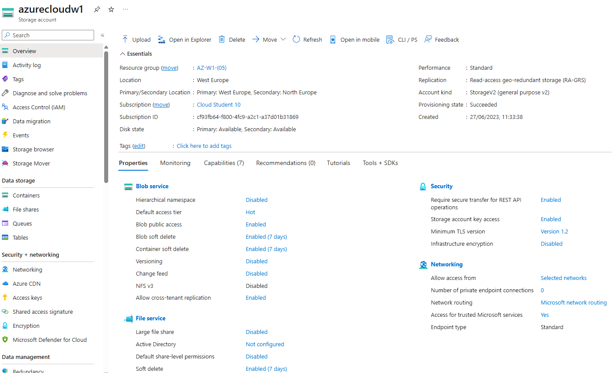
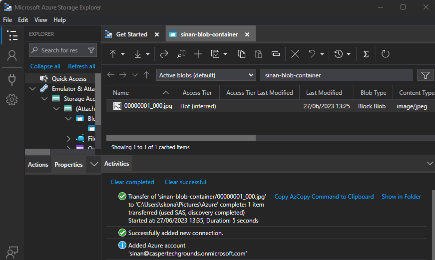
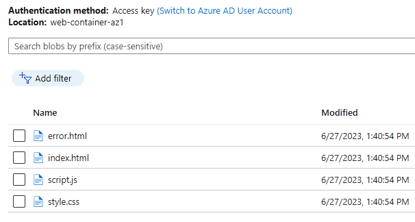
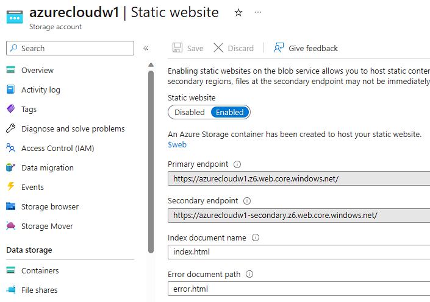
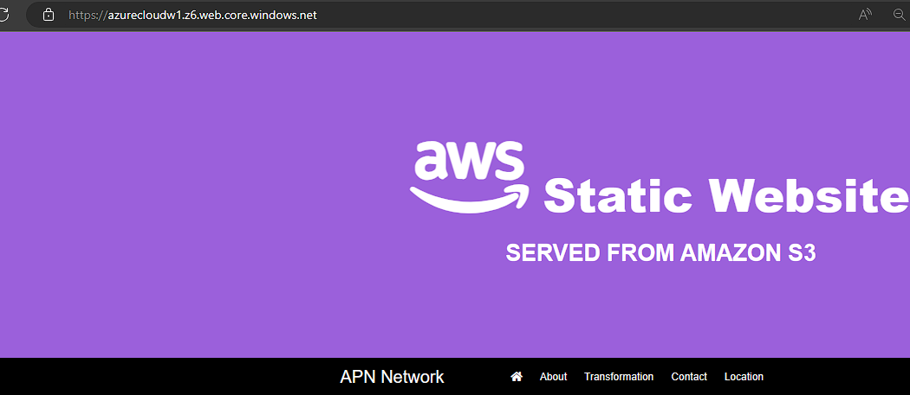

# AZ-05 - Azure Storage Account

In this Assigment we will take a deeper dive into the concept of creating and using an Azure Storage Account.

Azure Storage Account is a service provided by Microsoft Azure that offers secure and scalable storage for various types of data. It acts as a central hub to store and manage different data objects, including blobs, files, disks, and tables.

Blobs, or Binary Large Objects, are ideal for storing unstructured data such as documents, images, videos, and backups. They provide a reliable and cost-effective way to store and access large amounts of data. Files, on the other hand, allow you to store and manage file shares that can be accessed by multiple virtual machines.

Disk Storage, enables the creation and management of virtual hard disks for virtual machines running in Azure. This allows for durable and high-performance storage specifically designed for virtual machine disks.

Azure Storage Explorer is a user-friendly tool that simplifies managing and accessing data stored in Azure Storage Account. It provides a graphical interface for uploading, downloading, and managing data, making it easier to work with your stored objects.

Azure Storage Account is a key component of both Infrastructure as a Service (IaaS) and Platform as a Service (PaaS) offerings in Azure. It provides a foundation for storing data in a scalable and reliable manner, whether you are building virtual machines, web applications, or other cloud-based services.

When creating a storage account, by default, data in the storage account is encrypted by using Microsoft-managed keys

**blob** (Binary Large Objects) -> a data type that stores binary data like videos, pictures etc.

## Requirements

- [x] Your Azure Cloud Environment
- [x] Azure Storage Explorer

## Tasks

### Assignment 1

- [x] Create an Azure Storage Account. Make sure only you have access to the data.
- [x] Place data in a storage service of your choice via the console (for example, a cat photo in Blob storage).
- [x] Retrieve the data to your own computer using Azure Storage Explorer.

### Assignment 2

- [x] Create a new container.
- [x] Upload the 4 files that make up the AWS Demo Website.
- [x] Make sure Static Website Hosting is turned on.
- [x] Share the URL with a teammate. Make sure they can see the website

### Sources used

| Source       | Description |
| -----------  | ----------- |
| https://learn.microsoft.com/en-us/azure/storage/common/storage-account-create?tabs=azure-portal | MS Learn - Creating a Storage Account |
| https://learn.microsoft.com/en-us/azure/storage/blobs/storage-blob-static-website-how-to?tabs=azure-portal | Static Website Hosting MS Learn |
| https://www.youtube.com/watch?v=M_1R0ZOlP-w | Azure Blob Storage Containers - guide |

### Problems experienced

None.

### Result
*Below you will find the images showing the results along with their descriptions*

**Assignment 1**

- Created an Azure Storage Account, an overview:

- I created a new container and uploaded a cat picture to the container using the portal. Afterwards I installed Azure Storage Explorer on my local machine and transferred the file in the Azure container to my own PC. :

----------------------

**Assignment 2**

*Static websites have some limitations. For example, If you want to configure headers, you'll have to use Azure Content Delivery Network (Azure CDN). There's no way to configure headers as part of the static website feature itself*

Created a new container and uploaded the files needed to host a webpage.

Enabled static Web hosting with correct config:

To clear the assignment, I added the public ip-address of my peer to the Firewall white-list of my storage account.

 

 
