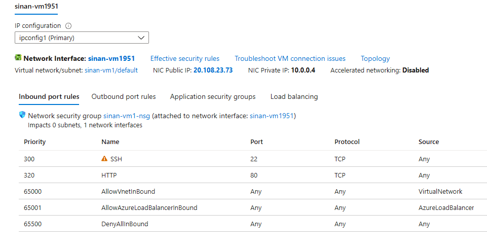
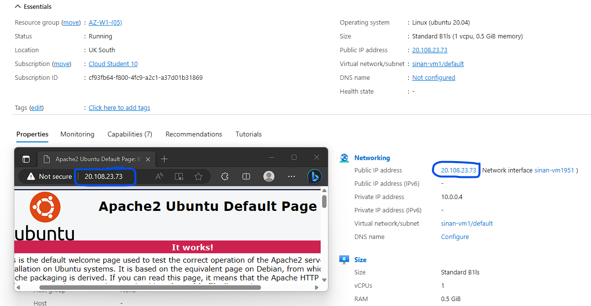

# AZ-06 - Virtual Machines

In this Assigment we will take a deeper dive into the concept of creating and using an Azure VM's (Virtual Machines)

Azure Virtual Machines (VMs) allow you to deploy and run virtualized instances of operating systems and applications. They provide the flexibility and scalability of cloud computing while simulating the functionality and performance of physical servers. VM's operate within Azure data centers, which are secure and highly available facilities housing powerful servers and networking infrastructure. With VMs, you can create and manage multiple instances of virtual machines remotely, eliminating the need for physical servers on-site.

To access and manage Azure Virtual Machines, you can use SSH (Secure Shell) for Linux-based VMs and RDP (Remote Desktop Protocol) for Windows-based VMs. These protocols enable you to securely connect to your VMs and perform various tasks.

Network Security Groups (NSGs) and firewalls add an additional layer of security to Azure VMs. NSGs allow you to define inbound and outbound traffic rules, controlling the network access to your VMs. Firewalls protect your VMs from unauthorized access and ensure the safety of your data.

Azure VMs offer the capability to provide user data and custom data during the provisioning process. User data allows you to run scripts and execute commands when the VM starts, enabling custom configurations. Custom data, on the other hand, helps in automating VM setup and deployment processes.

Azure VMs come in different sizes, allowing you to choose the appropriate computing power, memory, and storage capacity for your specific workload. This flexibility ensures that you can scale your VMs according to your requirements, optimizing performance and cost efficiency.

The pricing for Azure VMs follows a pay-as-you-go model, where you only pay for the actual usage of resources. Additionally, Azure offers Reserved Instances, which provide significant cost savings for long-term commitments, and Spot Instances, which offer discounted prices for short-term workloads, allowing for cost optimization.


## Requirements

- [x] Your Azure Cloud Environment


## Tasks

- [x] Create a VM with the following requirements:
```
Ubuntu Server 20.04 LTS - Gen1
Size: Standard_B1ls
Allowed inbound ports:
HTTP (80)
SSH (22)
OS Disk type: Standard SSD
Networking: defaults
Boot diagnostics are not necessary
```
custom data:
```		#!/bin/bash
		sudo su
		apt update
		apt install apache2 -y
		ufw allow 'Apache'
		systemctl enable apache2
		systemctl restart apache2
```
- [x] Check if your server is working.


### Sources used

| Source       | Description |
| -----------  | ----------- |
| https://learn.microsoft.com/en-us/training/modules/create-windows-virtual-machine-in-azure/ | MS Learn - Creating a VM |
| https://learn.microsoft.com/en-us/training/paths/azure-linux/ | MS Learn - Linux on Azure |


### Problems experienced

None.


### Result
*Below you will find the images showing the results along with their descriptions*

- Created an Azure Virtual Machine with the specified conditions given in the assignment.

*Below an overview of network configuration set on the VM I created:*
 


- To conclude, an overview of a running VM that I created along with the apache webserver homepage accessed through the corresponding public azure- IP that is assigned to the VM :




 
