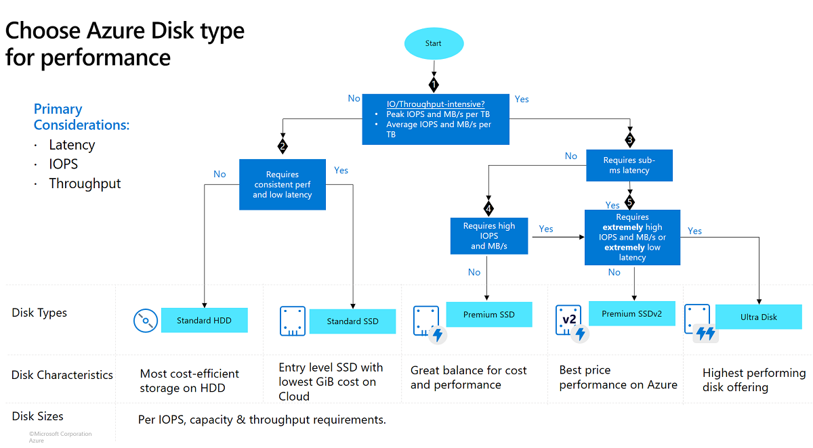
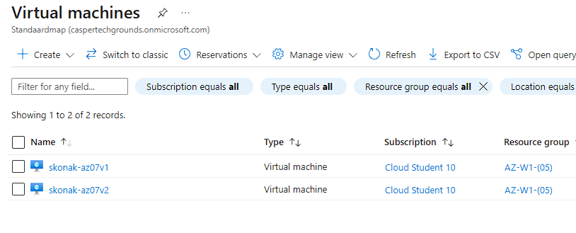
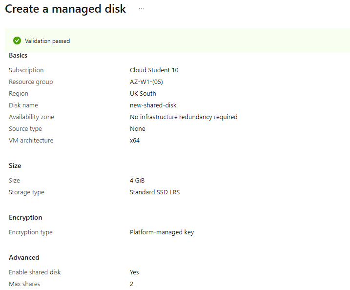
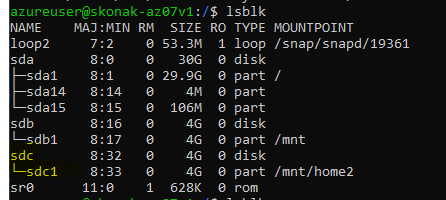
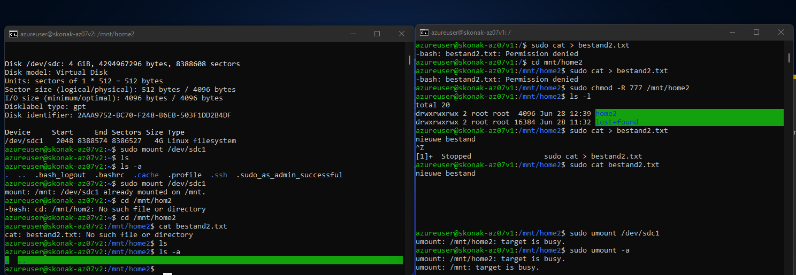
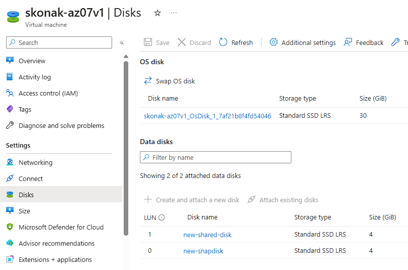
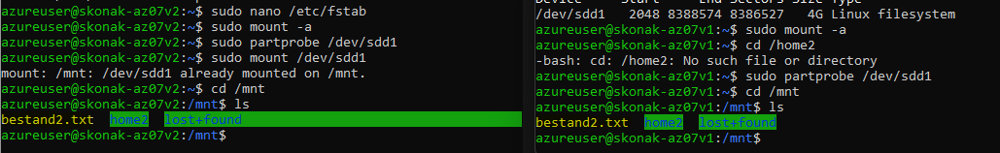

# AZ-07 - Azure Disk Storage

Azure Disk Storage is a powerful and flexible storage solution provided by Microsoft Azure, designed to meet the storage needs of virtual machines (VMs) and other applications. It allows you to store and manage virtual hard drives, providing reliable and high-performance storage for your workloads.


## Key-terms

- [x] <strong>Managed disks</strong> -> service provided by Azure for the management and scaling of disk stora
- [x] <strong>Unmanaged disks</strong> ->  require manual management and are stored in Azure Storage Accounts. Unmanaged disks offer more control over the underlying storage configurations but lack some of the automated management features provided by managed disks.
- [x] <strong>SSD</strong> -> Solid State Disk, faster access times, ideal for workloads that require high performance
- [x] <strong>HDD</strong> -> Older hard disk technology, lower cost, for workloads that prioritize capacity over speed
- [x] <strong>IOPS</strong> -> input/output operations per second
- [x] <strong>Disk Throughput</strong> -> the amount of data that can be transferred to and from a disk within a given period. It determines the disk's data transfer rate and influences the performance of your applications.
- [x] <strong>Disk Throughput</strong> -> refers to the speed at which data can be written to or read from a disk drive.
- [x] <strong>Azure Shared Disks</strong> -> Azure service that lets you attach a managed disk to multiple virtual machines (VMs)

*Azure Disk characteristics illustrated*



## Requirements

- [x] Your Azure Cloud Environment


## Tasks

- Start 2 Linux VMs. Makes sure you have access to both via SSH.
- Create an Azure Managed Disk and attach it to both VMs at the same time.
- On your first machine, create a file and place it on the Shared Disk
- See if you can read the file on the second machine.
- Take a snapshot of the disk and try to create a new Disk from it
- Mount this new Disk and view the file.


### Sources used

| Source        | Description |
| ----------- | ----------- |
| https://learn.microsoft.com/en-us/azure/virtual-machines/disks-shared-enable?tabs=azure-portal | MS Learn - enabling shared disks |
| https://learn.microsoft.com/en-us/azure/virtual-machines/disks-shared | MS Learn article on shared disks |
| https://help.ubuntu.com/community/UsingUUID | Linux commands for identifying drives |
| https://linuxhint.com/list_disks_ubuntu/ | Linux disk commands |
| https://learn.microsoft.com/en-us/azure/virtual-machines/linux/attach-disk-portal?tabs=ubuntu | MS Learn - attach disk Linux VM |


### Problems experienced

I and my peers weren't sure why we couldn't find the file we created before creating a snapshot. It took some time to figure this out.


### Result
*Below you will find the images showing the results along with their descriptions*

Created two Linux VMs on Azure:



Azure Managed Disk created with shared disk enabled:



So after connecting to both of my Linux VM's using SSH from my local machine, I first checked weither the shared disk was recognized by the VM using ```lsblk```. Marked in yellow is the shared disk (sdc). (My pc crashed during this assignment so I lost my initial config, therefore the shared disk is already partitioned using ```fdisk```) :

 

So after I created a file on my first VM, I moved it to the shared disk after mounting it. The I checked if I could find the file on my second VM. (No, nothing there) :



So for the final part, I created a Snapshot of the shared disk and created a new managed disk from the snapshot ```new-snapdisk```. :



To conclude I mounted the newly created shared disk and checked again on both of my VMs. This time the file was succesfully found:



