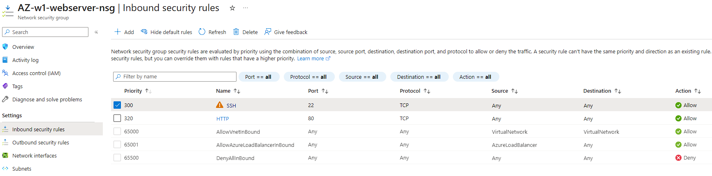
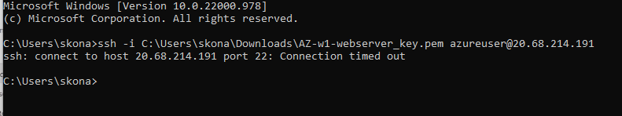
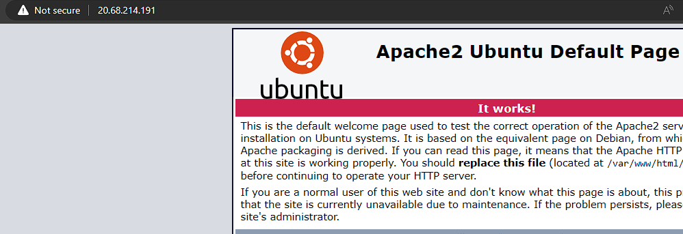

# AZ-08 - Azure Firewall

In this Assigment we will take a deeper dive into the concept of Azure Firewall

Azure Firewall helps secure your network by enforcing inbound and outbound traffic rules based on application, network, and user-defined policies. It enables you to filter and control network traffic based on IP addresses, ports, protocols, and application-specific rules, ensuring that only authorized traffic can access your resources.

One of the key advantages of Azure Firewall is its integration with Azure Monitor and Azure Security Center, which allows you to gain visibility into your network traffic and monitor potential threats. It also offers logging and analytics capabilities, providing valuable insights into your network security posture.

## Differences Explained
**Basic and Premium Firewall** ->
The main difference between Basic and Premium Firewall offerings in Azure is the set of features they provide. The Basic Firewall is a cost-effective option that offers essential firewall capabilities, such as inbound and outbound traffic filtering based on IP addresses and ports. It is suitable for basic network security needs.

The Premium Firewall provides advanced features, including threat intelligence-based filtering, application-level filtering, and integration with Azure Sentinel for enhanced threat detection and response.

**Firewall and Firewall Policy** ->
Firewall refers to the actual network security service or device that filters and controls traffic based on specified rules

Firewall Policy refers to a set of rules and configurations that define how the firewall operates. It specifies what types of traffic are allowed or blocked, which applications are permitted, and other security parameters.

**Azure Firewall and NSG** ->

Azure Firewall is a managed, centralized network security service that operates at the application and network layers. It provides advanced filtering capabilities, deep packet inspection, and integration with other Azure services. It is primarily used for securing outbound and inbound traffic to and from Azure virtual networks.

Network Security Groups (NSGs) are a basic network security feature in Azure that operate at the transport layer (Layer 4) of the network stack. NSGs allow you to create and enforce security rules that control traffic flow based on IP addresses, ports, and protocols. They are commonly used to secure traffic between virtual machines within a virtual network or between virtual networks.

## Key-terms

- [x] <strong>NSG</strong> ->  Network Security Groups, a basic network security feature in Azure that operate at the transport layer (Layer 4) of the network stack.
- [x] <strong>VNet</strong> -> Azure Virtual Network 
- [x] <strong>Hub and Spoke</strong> -> a networking model for efficiently managing common communication or security requirements.

## Requirements

- [x] Your Azure Cloud Environment
- [x] Azure Documentation

## Tasks

- Turn on a web server. Make sure the ports for both SSH and HTTP are open.
- Create an NSG in your VNET. Make sure your web server is still reachable via HTTP, but SSH is blocked.

### Sources used

| Source        | Description |
| ----------- | ----------- |
| https://learn.microsoft.com/en-us/azure/cloud-adoption-framework/ready/azure-best-practices/hub-spoke-network-topology | MS Learn - Hub-and-Spoke |
| https://learn.microsoft.com/en-us/azure/firewall/overview | MS Learn article on Azure Firewall |
| https://learn.microsoft.com/en-us/azure/virtual-network/network-security-groups-overview | MS learn - Network Security Groups |
| https://www.youtube.com/watch?v=aP-8PiiB7fA | Azure NSG Basics |

### Problems experienced

None.

### Result
*Below you will find the images showing the results along with their descriptions*

First I created a VM on azure with a custom data config that boots the VM with a apache webserver on active.

Then after deployment, opening the NSG resource we can go over to the *inbound security rules tab* where we can configure rules for our firewall. 

Inbound security rules -> delete SSH inbound rule so that the firewall blocks incoming ssh connection requests. :

We test the new config by trying to connect to the VM with ssh, connection timed out so the firewall is doing its work:

Lastly I tested weither the webserver is publicly accessible through HTTP:

Success :)
 
