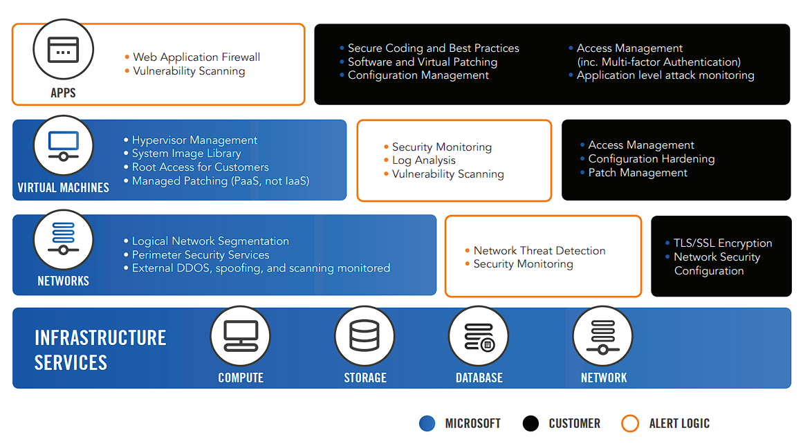

# AZ-09 - Shared Responsibility Model

In this Assigment we will take a deeper dive into the concept of the 'Shared Responsibility Model'

The Shared Responsibility Model is a fundamental concept in the context of the Azure Cloud platform that defines the division of responsibilities between Microsoft Azure and its customers. It clarifies who is responsible for various aspects of security and management when utilizing the Azure Cloud services.

Microsoft Azure takes care of the underlying infrastructure, including datacenters, networking, and physical security measures. They ensure that the infrastructure is reliable, available, and protected. This means they are responsible for tasks such as hardware maintenance, datacenter security, and network connectivity.

On the other hand, customers are responsible for managing their applications, data, user access, and compliance with industry regulations. They have control over their virtual machines, storage accounts, and other resources deployed in Azure. Customers need to implement appropriate security measures, such as encryption, firewalls, and access controls, to safeguard their data and applications.

Azure provides a wide range of security features and tools that customers can leverage to enhance the security of their deployments. However, customers are accountable for configuring and utilizing these security features effectively to protect their data and applications.

While Microsoft Azure takes care of the infrastructure and platform security, customers are responsible for securing their applications and data within Azure. This includes tasks like securing their virtual machines, implementing strong authentication mechanisms, monitoring for suspicious activities, and ensuring compliance with data protection regulations.

By understanding the Shared Responsibility Model, customers can align their security practices and efforts accordingly. They can focus on securing their applications and data, while relying on Azure to provide a secure and reliable infrastructure.

----------------------------------------------------

**Azure Cloud Service Levels**

- [x] *Azure operates at all three service levels: SaaS, PaaS, and IaaS.*
- For **SaaS**, Azure provides services like Azure DevOps, Dynamics 365, and Office 365.
- For **PaaS**, Azure is responsible for services such as Azure App Service, Azure Functions, and Azure SQL Database.
- For **IaaS**, Azure provides services like Azure Virtual Machines, Azure Storage, and Azure Virtual Networks. Microsoft is responsible for securing the foundational services of the cloud. You are responsible for the configuration 
of those services and your data on the cloud.
- Azure also allows hybrid scenarios, enabling organizations to integrate their on-premises infrastructure with Azure services.

### Sources used

| Source        | Description |
| ----------- | ----------- |
| https://learn.microsoft.com/en-us/azure/security/fundamentals/shared-responsibility | Shared responsibility in the cloud - MS Learn |
| https://cloudsecurityalliance.org/blog/2020/08/26/shared-responsibility-model-explained/ | Shared Responsibility Model Explained |
| https://www.alertlogic.com/assets/azure/AL_Azure_Understanding_Shared_Security.pdf | Article on MS Azure and responsibility |

