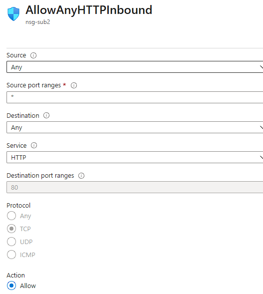
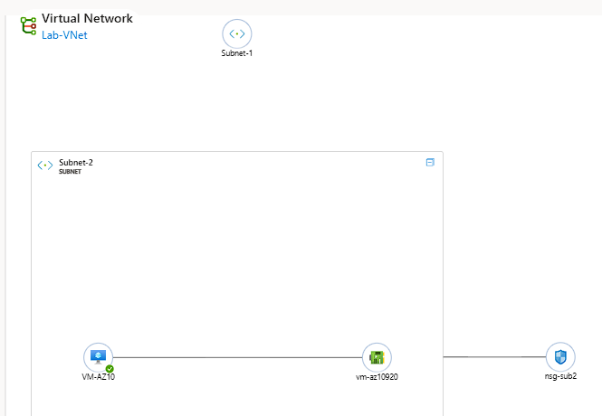

# AZ-10 - Azure Virtual Network (VNet)

In this Assigment we will take a deeper dive into the concept of Azure virtual networks (VNets)

Azure virtual networks (VNets) play a crucial role in enabling communication between various resources, such as virtual machines (VMs), web apps, and databases. They facilitate connectivity between these resources, users on the internet, and machines located on-premises.

*VNets are responsible for the following key functions:*

- **Network isolation and segmentation**: -> VNets provide a secure and isolated environment for resources within the network.

- **Internet communication**: -> They enable communication between Azure resources and users on the internet.

- **Communication between Azure resources**: -> VNets allow seamless communication between different Azure resources deployed within the network.

- **Communication with on-premises resources:** -> They establish connectivity between Azure resources and machines located on-premises.

- **Network traffic routing:** -> VNets efficiently route network traffic between different resources within the network.

- **Network traffic filtering:** -> They filter and control network traffic to ensure security and compliance.

- **Connection to other VNets:** -> VNets can be connected to each other through virtual network peering, facilitated by *user-defined routing* (UDR). This enables communication between VNets located in different regions.

When creating a new VNet, you define a private IP range for your network. Within that range, you can create subnets to further organize and manage your resources.

*There are three ways to connect your VNet to an on-premises network:*

- **Point-to-site VPNs:** -> Allows on-prem computers to access the Azure VNet using a VPN connection.
- **Site-to-site VPNs:** -> Establishes a connection between the on-prem VPN device or gateway and the Azure VPN Gateway, effectively creating one large local network.

- **Azure ExpressRoute:** -> Provides a physical connection from your local environment to Azure, enabling a dedicated and high-bandwidth connection.

Additionally, Azure VNets can be interconnected using virtual network peering, which is facilitated by user-defined routing (UDR). This enables seamless communication between VNets deployed in different regions.


## Requirements

- [x] Your Azure Cloud Environment


## Tasks

**Assignment 1**
- Create a Virtual Network with the following requirements:
```
Region: Western Europe
Name: Lab-VNet
IP range: 10.0.0.0/16
```
Requirements for subnet 1:
```
Name: Subnet-1
IP Range: 10.0.0.0/24
This subnet must not have a route to the Internet
```
Requirements for subnet 2:
```
Name: Subnet-2
IP Range: 10.0.1.0/24
```
**Assignment 2**

*Create a VM with the following requirements:*
An apache server must be installed with the following custom data:
```
#!/bin/bash
sudo su
apt update
apt install apache2 -y
ufw allow 'Apache'
systemctl enable apache2
systemctl restart apache2

SSH access not needed, HTTP needed
Subnet: Subnet-2
Public IP: Enabled
```
- Check if you can reach your website


### Sources used

| Source        | Description |
| ----------- | ----------- |
| https://learn.microsoft.com/en-us/azure/virtual-network/concepts-and-best-practices | MS Learn - Vnets article |
| https://www.youtube.com/watch?v=btcKhQPf3HI | Azure Vnets and Subnets |
| https://learn.microsoft.com/en-us/azure/virtual-network/network-security-groups-overview | MS learn - Network Security Groups |
| https://www.youtube.com/watch?v=aP-8PiiB7fA | Azure NSG Basics |


### Problems experienced

I couldn't connect to the webserver at first, after troubleshooting I discovered that the proper inbound rules on the NSG were lacking or misconfigured. So I fixed that shortly after. 

 


### Result
*Below you will find the images showing the results along with their descriptions*

**Assignment 1**

I created a VN with the settings stated at *assignment 1*
The subnets differ from each other. The second one needs internet access and therefore requires a NAT device.
This automatically means that a NSG is also needed, and will add more security to our network :

   

   

----------------------

**Assignment 2**

For the second assignment I created a VM with the conditions stated at the tasks under *assignment 2*
I assigned the VM to subnet 2 in order to be able to connect to its active webserver.


I set a new inbound rule for the NSG in order to be able to connect to it through the public internet:



Tested the connection again, and this time I had access.


------------------------------------------------------------

To conclude I captured the topology which displays my Virtual Network configuration for the assignments:




