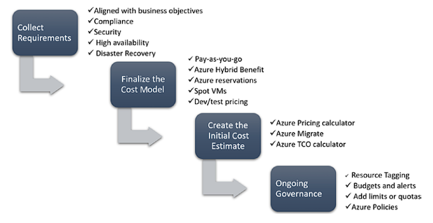

# AZ-012 - Well-Architected Framework

In this Assigment we will take a deeper dive into the concept of Well-Architected Framework(s)

The framework is built upon five key pillars, each addressing a specific aspect of a well-architected system:

**Reliability**: This pillar focuses on ensuring that your system operates continuously and can recover from failures. It emphasizes the implementation of fault tolerance, backup and restore mechanisms, and the ability to handle changes in demand.

**Security**: Security is of utmost importance in any cloud architecture. This pillar guides you in protecting your data, systems, and assets. It covers identity and access management, data protection, infrastructure security, and threat detection and response.

**Cost optimization**: Cost optimization is about maximizing the value of your cloud resources while minimizing unnecessary expenses. This pillar helps you understand and control costs by optimizing resource usage, selecting the right pricing models, and leveraging cost-effective services.

**Operational excellence**: Operational excellence focuses on ensuring efficient operations and streamlined processes. It includes automation, monitoring, and incident management, allowing you to quickly identify and address issues, while continuously improving your operations.

**Performance efficiency**: This pillar helps you optimize the performance of your system and ensure efficient resource utilization. It covers areas like selecting the right compute and storage options, designing for scalability, and optimizing network and database performance.

By following the Well-Architected Framework, organizations can design and build cloud architectures that are robust, secure, cost-efficient, operationally effective, and high-performing. It provides a structured approach to cloud architecture, offering guidance and best practices to help organizations make informed decisions and achieve their desired outcomes.

*Description of the five pillars according to Microsoft*:

*Additionally an overview of the Well-Architected-Framework illustrated by Microsoft:*

--------------------------------------------------------

## General Design Principles
- Enable architectural evolution
- Use data to make decisions
- Educate and enable
- Automate

-----------------------------------------------------

### Cost Optimization - Design Principles
- Plan and Estimate Costs
- Provision with Optimization
- Use Monitoring and Analytics to gain Cost Insights

*Cost-optimization-process*:

-----------------------------------------------------------------

### Operational Excellence - Design Principles
- Adopt DevOps. (agility and more frequent deployment cycles)
- Streamline the build and release of workloads.
- Focus on monitoring and continuous improvement -> gives key insights into the overall system’s operational health
- Design loosely coupled applications (so not monolithic) cloud-native services such as microservices, PaaS, serverless, etc.
- Learn from failures and incidents. e.g. ITIL approach
- test-driven development approach

**Practices to optimize workloads**
- Build workloads with **confidence** using proven best practices
- **Actionable & simple-to-use** deep technical resources to design workloads that show results
- Know where to **focus** to optimize workloads

---------------------------------------------------

### Performance Efficiency - Design Principles
- Identify the right performance parameters from 
data.
- Plan for peak performance capacity through testing.
- Maintain the cost performance balance
- Implementing continuous monitoring and 
optimization.
- Make Best Use of Cloud Scalability -> Focus on Autoscaling for increased performance on-demand

-----------------------------------------------------------

### Reliability - Design Principles
- Quantify the availability targets. Using SLAs and SLOs so they can be measured. Also define RPO and RTO.
- Ensure application, data, and infrastructure reliability. + Reliability in performance.
- Manage the security risks that could impact resiliency. -> Organizations should follow the security best practices for respective Azure services in addition to configuring them for resiliency.
- Set up automated lifecycle management
- Design to recover from failure -> Ensure that an automated recovery mechanism is factored into the application design so that it can recover gracefully from failures. It should be aligned with the defined SLA/SLO and/or RPO/RTO targets.

----------------------------------------------------------------

### Security - Design Principles
- **Confidentiality**: Ensure that only authorized personnel 
have access to your data and applications by enabling 
the principle of least privilege
- **Integrity**: The data being transferred between 
systems should be tamper-proof so that there is no 
compromise on the integrity either at rest or in transit. 
Any modifications should be tracked through hashing 
algorithms that can be used to ensure that the data was 
not tampered with.
- **Availability**: Along with application component 
failures, organized attacks like DDoS can impair the availability of your 
application for authorized users. Implement strategies to prevent.

**Additional Security Guidelines**:
- Develop a well-defined security strategy.
- Design from an attacker’s perspective.
- Leverage native security tools and configurations (features offered by Azure)
- Integrate resiliency into your security strategy (assume failure, 
and ensure that you have implemented a layered security strategy)
- Assume zero trust.

*Security approach using multiple Layers*

---------------------------------------------------------------------

### Azure Well-Architected Review
The **Azure Well-Architected Review** is a process designed to help you review the state of your 
applications and workloads, and it provides a central place for architectural best practices and guidance. 
The Azure Well-Architected Review uses the Azure Well­Architected Tool which is based on the Azure
Well-Architected Framework.

*Azure Well-Architected Review* illustrated:*

### Sources used

| Source       | Description |
| ----------- | ----------- |
| https://learn.microsoft.com/en-us/azure/well-architected/  | Azure Well-Architected Framework - MS Learn |
| https://magicbeans.pt/wp-content/uploads/2023/01/Azure_Well_Architect.pdf | Azure Well-Architected review |
| https://www.youtube.com/watch?v=yOu5ho-ZMwQ&list=PLulN3zfhymBlWeS2jYhugRF2JU39WIDRA | Azure well architected framework Intro Video |
| https://www.youtube.com/watch?v=BF1Tw9MNa5U | MS Azure WAF - MS Developer |

 
