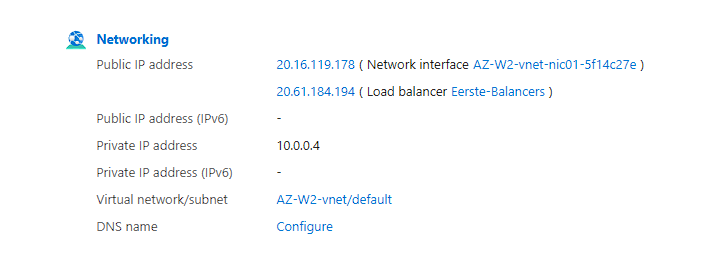
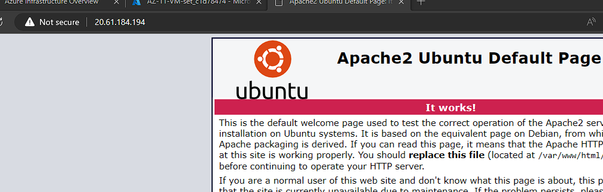
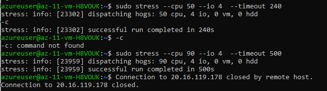
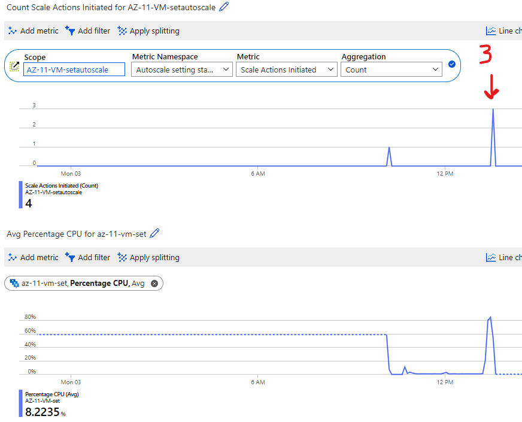
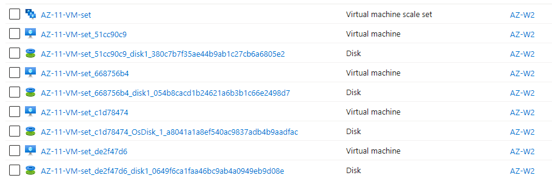

# AZ-011 - ALB & Auto Scaling

In this Assigment we will take a deeper dive into the concept of Azure Load Balancer (ALB) & Auto Scaling

Azure Load Balancer is a service that distributes incoming network traffic across multiple instances of an application or virtual machines (VMs). It acts as a traffic manager, ensuring that the workload is evenly distributed, optimizing resource utilization, and improving the overall performance and availability of the application.

Auto Scaling, is a dynamic and flexible feature that allows you to automatically adjust the number of instances based on the demand of your application. It ensures that you have enough resources to handle increased traffic and scales down during periods of low demand, optimizing costs and resource allocation.

To implement Auto Scaling, you can use VM Scale Sets, which allow you to manage a group of VMs as a single entity. Azure Monitor plays a crucial role in monitoring the performance and health of your application. It provides insights into metrics like CPU usage, network traffic, and response times, helping you make informed decisions about scaling.

By combining Azure Load Balancer and Auto Scaling, you can create a robust infrastructure that provides high availability and elasticity. When traffic increases, new instances can be automatically added to the pool, and Azure Load Balancer ensures that the traffic is distributed evenly across these instances.

**Stress testing**: Stress testing is done to determine the upper limit of tolerance for applications.

## Requirements

- [x] Your Azure Cloud Environment


## Tasks


**Assignment 1** 

- [x] Create a VM Scale Set with the following requirements:
```
Ubuntu Server 20.04 LTS - Gen1
Size: Standard_B1ls
Allowed inbound ports:
HTTP (80)
SSH (22)
OS Disk type: Standard SSD
Networking: defaults
Boot diagnostics are not necessary
Initial Instance Count: 2
Scaling Policy: Custom:
	- amount of VMs: 1 <between> 4
Add VM at 75% CPU usage
Remove VM at 30% CPU usage
```
custom data:
```		#!/bin/bash
		sudo su
		apt update
		apt install apache2 -y
		ufw allow 'Apache'
		systemctl enable apache2
		systemctl restart apache2
```
---------------------------------------------------
**Assignment 2** 

- [x] Check whether you can access the web server via the endpoint of your load balancer.
- [x] Perform a load test on your server(s) to activate auto scaling. There may be a delay in creating new VMs, depending on the settings in your VM Scale Set


### Sources used

| Source       | Description |
| ----------- | ----------- |
| https://learn.microsoft.com/en-gb/azure/load-testing/overview-what-is-azure-load-testing  | Azure Load testing - MS Learn |
| https://linuxhint.com/useful_linux_stress_test_benchmark_cpu_perf/ | Linux article on stress testing |
| https://learn.microsoft.com/en-gb/azure/load-testing/tutorial-identify-bottlenecks-azure-portal?wt.mc_id=azureportal_loadtesting_inproduct_overview | MS learn - identifying performance bottlenecks |


### Problems experienced

None.


### Result
*Below you will find the images showing the results along with their descriptions*

**Assignment 1** 

In Azure Portal, I first created a new resource "Virtual Machine Scale Set" with the parameters given in the tasks under assignment 1: 


At start, it created two VM instances but quickly scaled down to only 1 VM. It probably triggered because of low cpu utilization. So this tells me that the Autoscaling feature is doing its work.

Below an overview of the networking tab of the *Virtual Machine Scale Set* where we can see two public IP-adresses.

One is assigned to the load balancer that monitors and measures the incoming network traffic to the VM instances to evenly distribute the load. It's also the endpoint address for HTTP traffic.

The other address is assigned to the NIC (network interface contoller). This one serves as the network controller of the VM for establishing connections.

 

----------------------------------------------------------------

**Assignment 2** 

*access to the web server via the endpoint of the load balancer* ( ```20.61.184.194``` )

  
So in order to trigger the autoscale feature that is active on our VM scale set, I had to cause enough stress on the CPU. The auto scale trigger was set on 75% so that was the minimum amount of CPU utilization I had to cause. I solved this by using a tool called **stress** on my VM. It wasn't pre-installed so I had to run ```sudo apt install stress``` first.

When done, I started by excuting the following command -> ```stress --cpu 90 --io 4 --timeout 500``` This causes a heavy load on the cpu and takes a total time of 500 seconds.



After some time monitoring my instances, I noticed it eventually decided to add new VM instances to the VM scale set. The auto-scale service was finally comitted to take some pressure of by scaling out.



To confirm what I saw, I checked the all-resources tab. 4 instances were present now. 




 
