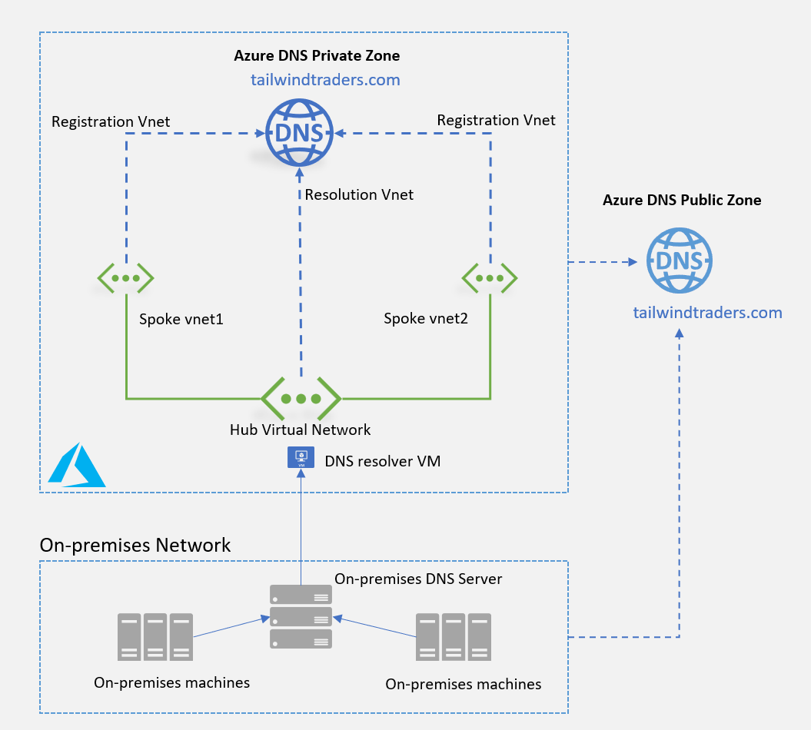
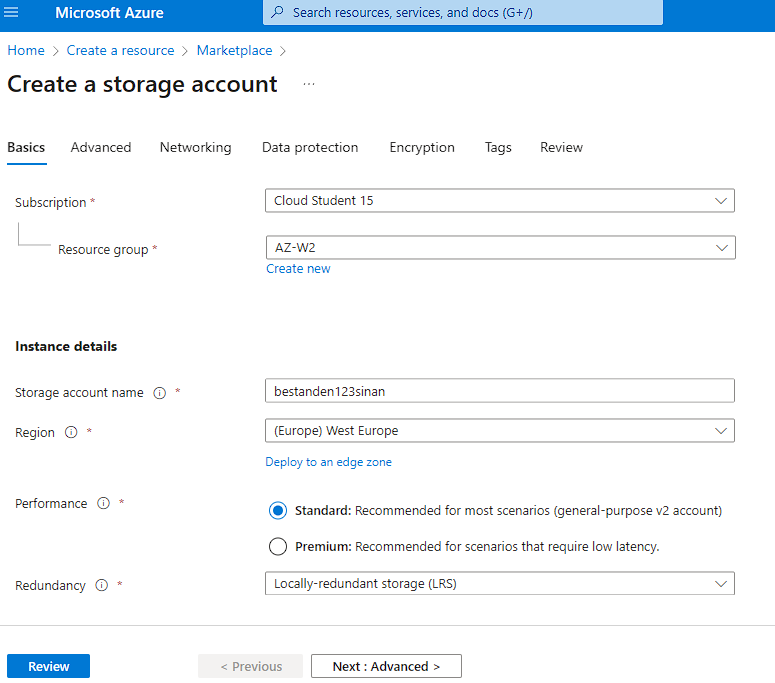
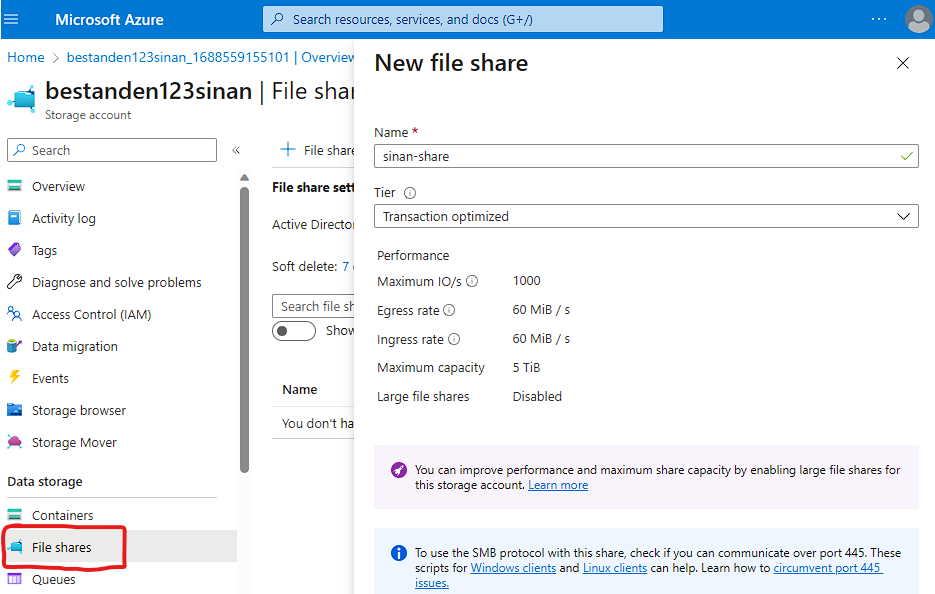
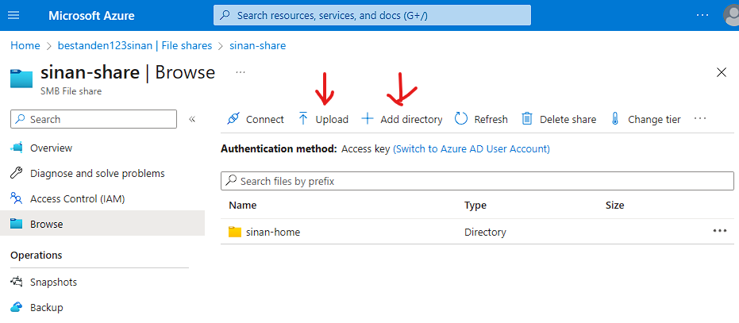

# AZ-13 - Files,AppServices,CDN,DNS,Database

In this Assigment we will take a deeper dive into multiple Azure Services and its practices. Comparisons with on-premises solutions will also be provided. 

Azure provides a wide range of apps and services that empower organizations to build, deploy, and scale their applications in the cloud. These services offer various capabilities to meet different application requirements and enable seamless development and management experiences.

## Azure App Service

Azure App Service is an HTTP-based service for hosting web applications, REST APIs, and mobile back ends. It's a fully managed platform as a service (PaaS) offering for developers.

**Why use it?**
App Service is used for quickly building, deploying, and scaling web and mobile applications. It provides a fully managed platform that abstracts away the underlying infrastructure, allowing developers to focus on application development.

### Key Features 
- Supports Multiple languages and frameworks. PowerShell and other scripts or executables can be run as background services.

- Managed production environment - App Service automatically patches and maintains the OS and language frameworks for you.
- Containerization and Docker - Dockerize your app and host a custom Windows or Linux container in App Service. Run multi-container apps with Docker Compose. Migrate your Docker skills directly to App Service.

- DevOps optimization - Set up continuous integration and deployment with Azure DevOps, GitHub, BitBucket, Docker Hub, or Azure Container Registry. Promote updates through test and staging environments.
 
- Global scale with high availability - Scale up or out manually or automatically. Host your apps anywhere in Microsoft's global datacenter infrastructure, and the App Service SLA promises high availability.

- Connections to SaaS platforms and on-premises data - Choose from many hundreds of connectors for enterprise systems (such as SAP), SaaS services (such as Salesforce), and internet services (such as Facebook). Access on-premises data using Hybrid Connections and Azure Virtual Networks.

- Security and compliance - App Service is ISO, SOC, and PCI compliant. Create IP address restrictions and managed service identities. Prevent subdomain takeovers.

- Authentication - Authenticate users using the built-in authentication component. Authenticate users with Azure Active Directory, Google and/or Microsoft account.

- Application templates - Choose from an extensive list of application templates in the Azure Marketplace, such as WordPress, Joomla, and Drupal.

- Visual Studio and Visual Studio Code integration - Dedicated tools in Visual Studio and Visual Studio Code streamline the work of creating, deploying, and debugging.

- API and mobile features - App Service provides turn-key CORS support for RESTful API scenarios, and simplifies mobile app scenarios by enabling authentication, offline data sync, push notifications, and more.

- Serverless code - Run a code snippet or script on-demand without having to explicitly provision or manage infrastructure, and pay only for the compute time your code actually uses.

--------------------------------------------------------------

## Content Delivery Network

To deliver content efficiently and improve user experience, Azure offers the Content Delivery Network (CDN). This service caches and delivers web content from the closest edge server to the user, reducing latency and improving performance.

**POP** -> Point-of-Presence : locations that are close to end-users, to minimize latency.


**Benefits of using Azure CDN:**
- Better performance and improved user experience for end users, especially when using applications where multiple round-trips requests required by end users to load contents.
- Large scaling to better handle instantaneous high loads, such as the start of a product launch event.
- Distribution of user requests and serving of content directly from edge servers so that less traffic gets sent to the origin server.

### How it Works

**Use Case Scenario**

A multinational e-commerce company, "Company X ," operates an online store that caters to customers worldwide. As the company experiences increasing traffic and user demand, they need a solution to deliver their web content quickly and efficiently to customers across the globe. They decide to leverage Azure CDN to enhance their website's performance and user experience.

1. **Content Analysis and Configuration** ->
The company first starts with analyzing their website's content and identifying the static assets that can be optimized for delivery through a content delivery network. This includes images, CSS files, JavaScript files etc.

2. **Azure CDN Setup** -> 
They proceed to set up Azure CDN by creating a CDN profile and configuring the settings, such as the pricing tier and the endpoint name. The endpoint location is chosen based on their POP location that is geographically closest to the user to ensure optimal content delivery (low latency).

3. **Origin Config & CDN Endpoint Config** ->
Next, the company configures the origin of their CDN endpoint. They specify the source location where their original website content is hosted, such as their Azure Web App or Storage Account. They also configure the CDN endpoint to define the caching behavior, content rules, and optimization options.

4. **Content Deployment and Testing** ->
The Company  deploys their static content to the origin source and conducts thorough testing to ensure the CDN is properly delivering the content. They verify that the CDN endpoint is serving the content faster and more efficiently than before.

5. **Monitoring and Optimization** ->
To monitor the CDN performance and identify areas for improvement, they utilize Azure Monitor and CDN analytics. They gain insights into traffic patterns, latency, and cache hit ratios, allowing them to optimize their CDN configuration further.

6. **Continuous Content Updates** ->
As Company X regularly updates their website with new content, they ensure that the updated content is promptly deployed to the origin source and replicated across the CDN endpoints. This ensures that customers receive the latest content without delays.

---------------------------------------------------------------------

## Azure DNS

Azure DNS is a reliable and scalable domain name system (DNS) hosting service that provides name resolution by using Microsoft Azure infrastructure. It allows you to host your domain names and translates human-readable domain names into IP addresses, making it easier for users to access your applications. By hosting your domains in Azure, you can manage your DNS records by using the same credentials, APIs, tools, and billing as your other Azure services.

Azure DNS allows your organization to host and manage public and private DNS records. It allows you to fully integrate your organization's public and private DNS namespaces with applications, services, and hosts that you deploy in Azure.

**DNS** -> The Domain Name System (DNS) translates, or resolves, a website or service name to its IP address. e.g. ```www.company123.com``` (a host record) mapping to a specific IP address ```(40.71.177.34)```.

DNS domains in Azure DNS are hosted on the Azure global network of DNS name servers. This system uses Anycast networking so that each DNS query is answered by the closest available DNS server. Azure DNS provides fast performance and high availability for your domain.

**Anycast** -> an IP network addressing scheme that allows multiple servers to share the same IP address, allowing for multiple physical destination servers to be logically identified by a single IP address.  In the context of a CDN, Anycast typically routes incoming traffic to the nearest data center with the capacity to process the request efficiently. Selective routing allows an Anycast network to be resilient in the face of high traffic volume, network congestion, and DDoS attacks.

*Anycast-vs-Unicast*


**Azure DNS public zones** -> Azure DNS public zones host domain name zone data for records that you intend to be resolved by any host on the internet.

Use Public DNS Zones if:
- When you want a highly resilient DNS server service to host your DNS zone data.
- You don't want to manage your own DNS servers or the underlying operating systems that host those services.
- You want DNS record management for your Azure resources integrated into your Azure management tools.
- You don't need access to features such as DNSSEC, Active Directory Integrated DNS Zones, or zone transfer.

**Azure DNS private zones** -> Azure DNS Private zones are used to resolve domain names within a specific Azure virtual network. They enable name resolution for resources within a virtual network, such as virtual machines, without exposing them to the public internet.

*Use Public DNS Zones if:*
- you want to provide DNS zones only to hosts on specific Azure virtual networks
- You want to automatically register hosts in a specific Azure virtual network.
- You want to allow private DNS zone data to be accessible across multiple virtual networks in your subscription. 
- You want to use DNS in a split horizon configuration. A configuration where a limited number of DNS records are available to clients on the internet, but a full set of records is available to hosts in Azure virtual networks.
- You want to configure records in your DNS zone to point to Azure private endpoints such as Azure Storage, Azure Cosmos DB, or Azure SQL Database.




---------------------------------------------------------------

## Azure Files

Azure Files is a fully managed file storage service that offers shared file storage in the cloud, allowing applications and virtual machines to access files using the standard SMB (Server Message Block) or Network File System (NFS). Azure Files also has a REST API (application programming interface)

SMB Azure file shares are accessible from Windows, Linux, and macOS clients. NFS Azure file shares are accessible from Linux clients. Additionally, SMB Azure file shares can be cached on Windows servers with Azure File Sync for fast access near where the data is being used.

**Key features of Azure Files**
- makes it easy to move all your on-premises files and applications to the cloud and enables you to effectively manage your files in the cloud.
- makes it easy to "lift and shift" applications to the cloud that expect a file share to store file application or user data.
- offers multiple tiers that you can select based on your budget and performance needs.
- Azure file shares can be used as persistent volumes for stateful containers. For the containers that access raw data at every start, a shared file system is required to allow these containers to access the file system no matter which instance they run on.

**Azure File Sync** -> enables centralizing your organization's file shares in Azure Files, while keeping the flexibility, performance, and compatibility of a Windows file server.

**Why use File Sync?**
```
- Centralize file share backups in Azure to optimize cost and manageability
- Free up on-premises storage capacity to avoid buying more storage
- Maintain on-premises file share performance for frequently used files
- Migrate on-premises file shares to Azure Files
- Provide low latency, multi-site access for file shares
```
**Practical scenarios where Azure Files is beneficial**
- *Shared File Storage:* -> Multiple VMs or applications running in Azure can access the same set of files, facilitating collaboration and data consistency.
- *Lift-and-Shift Migrations:* -> When migrating on-premises applications to Azure, Azure Files can be used as a drop-in replacement for file shares, ensuring minimal application modifications.
- *Application Data:* -> Files used by applications, such as configuration files, logs, and user data, can be stored in Azure Files, providing easy access and data persistence.

**Linking with Azure Database**
Azure Files can be linked with Azure Database, specifically Azure SQL Database, in the following ways:

- *Application Data Storage:* -> Azure Files can serve as a shared storage location for database backup files, providing a centralized repository accessible by multiple instances of Azure SQL Database.
- *Database Import/Export:* ->  Azure Files can be used to import and export data from Azure SQL Database. Database export files can be stored in Azure Files for easy retrieval and transportation.
- *File Stream Storage:* -> Azure Files can be used as the file stream storage location for SQL Server instances hosted in Azure VMs, allowing efficient file streaming operations.


---------------------------------------------------------

## Assignment in practice

For the practical part of this assignment, we will take a look at *Azure Files* and *Azure Database* and perform some tasks using the Azure Portal Environment. 

**Tasks to perform**
- Finding the above mentioned services in Azure Portal.
- Turning these services on.
- Linking the services to other resources.

**Step 1** -> Create a Storage Account in order to use Azure Files:



**Step 2** -> Create an azure file share using your storage account:

On the storage account page, in the Data storage section, select File shares. Then click on '+ File Share' to create a new file share.



**Step 3** -> Add a Directory to upload your files

On the file shares page go to your newly created file share and click on "+ Add Directory" give it a name ```sinan-home``` in our case.

Here we can upload files to this folder by clicking upload and selecting the files we want to upload on our local machine. 



You can connect to your Azure File Shares via the connect button on the same page. Using the SMB protocol a connection can be established from your local client to the Azure Files Folder.

 

## Azure (SQL) Database 


-----------------------------------------------------------------

### Sources used

| Source       | Description |
| ----------- | ----------- |
| https://learn.microsoft.com/en-us/azure/cdn/cdn-overview  | content delivery network overview - MS Learn |
| https://learn.microsoft.com/en-us/azure/app-service/overview | Azure App Service overview - MS Learn |
| https://learn.microsoft.com/en-us/azure/dns/dns-overview | Azure DNS overview - MS Learn |
| https://learn.microsoft.com/en-us/azure/dns/dns-faq | Azure DNS FAQ - MS Learn |
| https://www.cloudflare.com/en-gb/learning/cdn/glossary/anycast-network/ | Anycast Explained |
| https://learn.microsoft.com/en-us/training/modules/introduction-to-azure-files/3-what-is-azure-file-sync | Azure File Sync - MS Learn |
| https://learn.microsoft.com/en-us/azure/storage/files/storage-how-to-use-files-portal?tabs=azure-portal | Azure Files Quick Start - MS Learn |
| ----------- | ----------- |

--------------------------------------------------------------------


 
