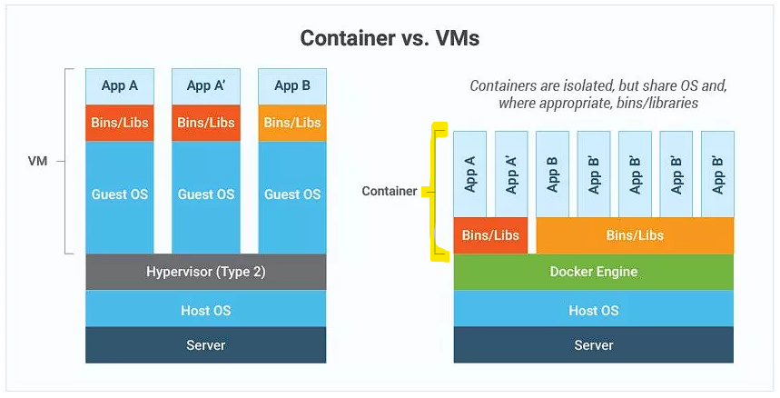
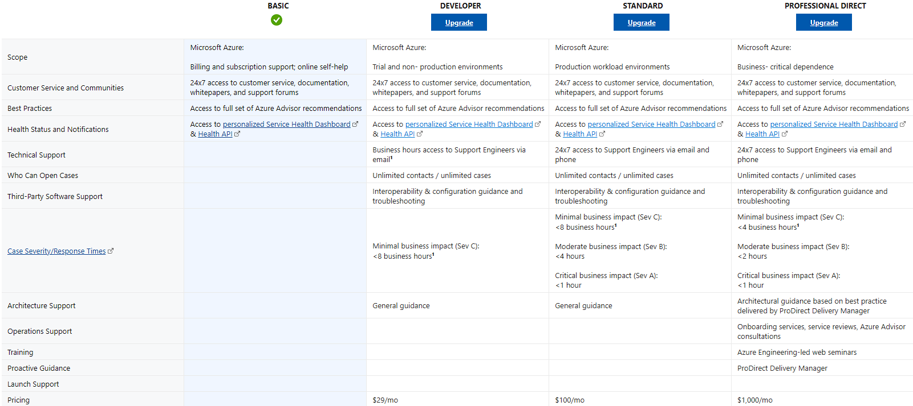
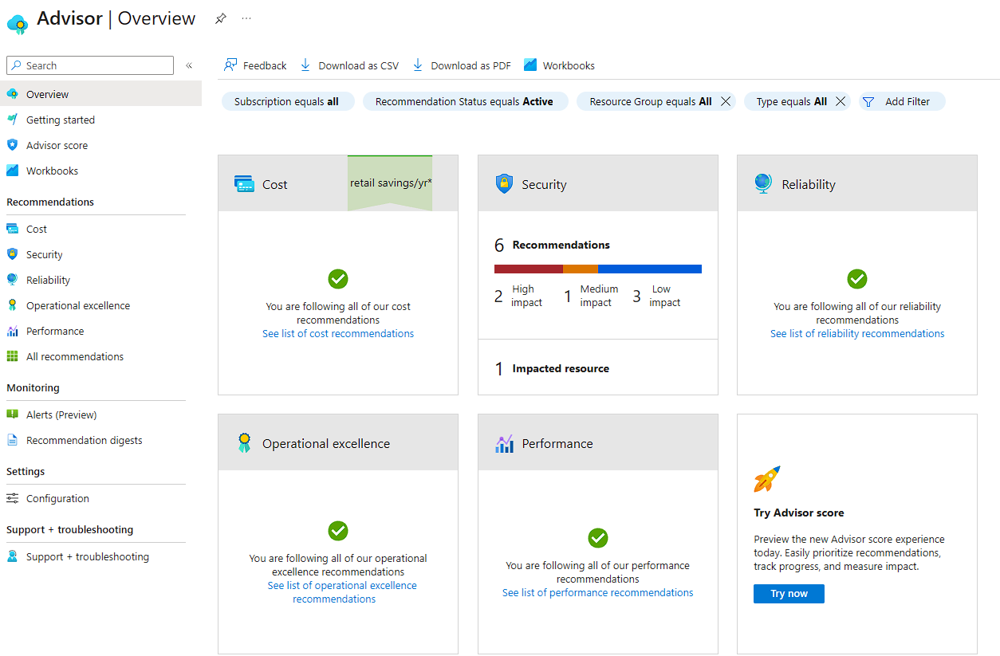
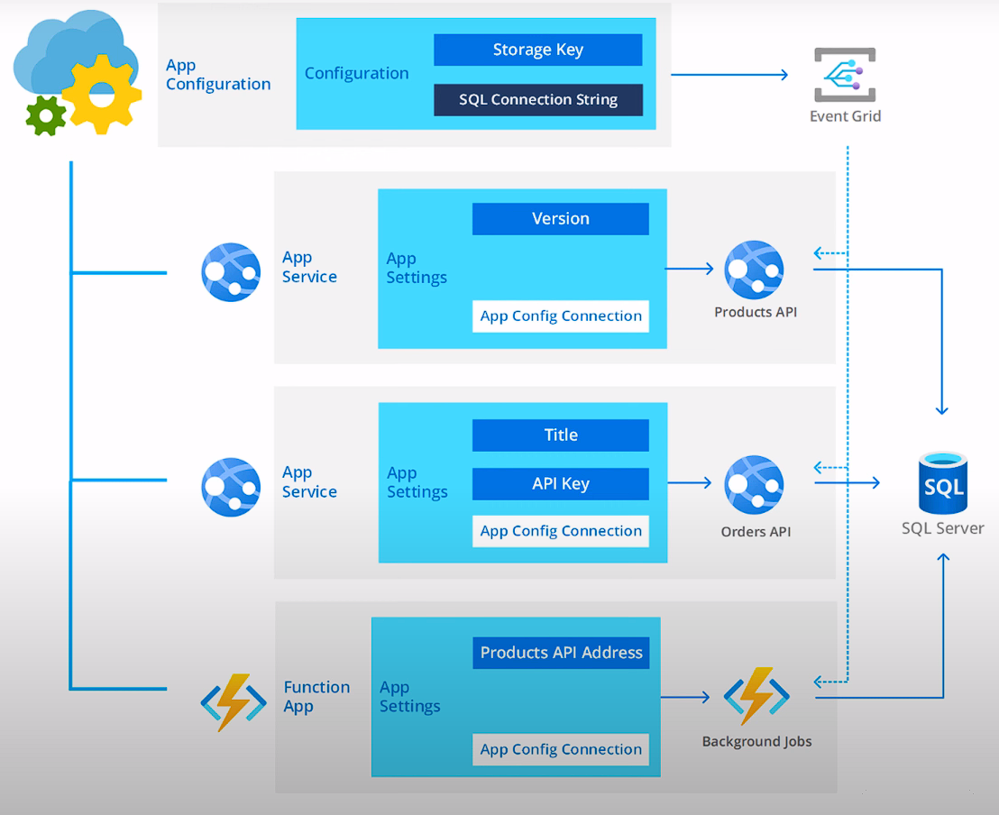
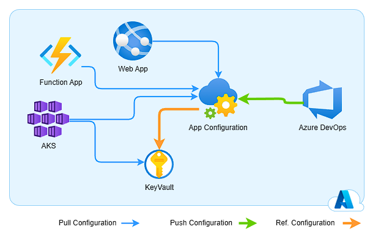
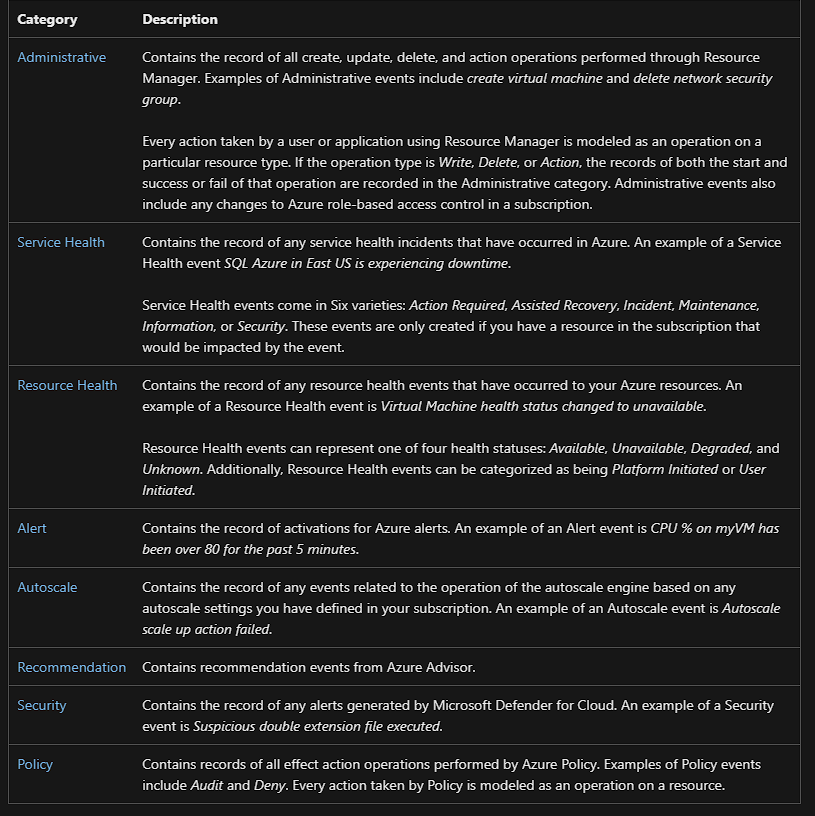

# AZ-14 - Containers, Support Plans, Advisor, App Configuration, Activity Log

In this Assigment we will take a deeper dive into multiple Azure Services and its practices.  

Azure provides a wide range of apps and services that empower organizations to build, deploy, and scale their applications in the cloud. These services offer various capabilities to meet different application requirements and enable seamless development and management experiences.

## Azure Containers

Azure Containers is a service offered by Microsoft Azure that allows you to run applications in isolated, lightweight containers. 

Containers are like lightweight, virtualized environments that package an application with its dependencies, libraries, and files. They provide a consistent and isolated environment for applications to run, without interfering with other applications or the underlying operating system.

**Main Benefits:**
```
[Application Deployment]: 
Containers are used to package applications, allowing them to be easily deployed and run on different machines or environments without worrying about compatibility issues. Developers can build an application once, package it in a container, and run it on any computer that supports containers.

[Scalability]:
Containers make it easier to scale applications. If you have a popular website, you can use containers to create multiple copies of the website and distribute the load among them. This way, as the number of users increases, you can add more containers to handle the increased demand.

[Portability]:
Containers provide a consistent environment for applications to run across different systems and platforms. They encapsulate all the dependencies, libraries, and configurations needed for an application, making it easy to package, deploy, and run the application consistently across different environments, from development to production.

[Isolation]:
Containers provide application-level isolation, ensuring that each container runs independently of others. This isolation prevents conflicts between applications and avoids issues caused by one application impacting another. It also enhances security by limiting the attack surface and reducing the impact of potential vulnerabilities.

[Efficiency]:
Containers are lightweight and efficient. They share the host operating system's kernel, which eliminates the need for running a full operating system for each application instance. This leads to faster startup times, lower memory usage, and better overall resource utilization compared to traditional virtual machines (VMs).

[Continuous Deployment and DevOps]:
They enable consistent and reliable deployment of applications, facilitate automation, and improve collaboration between development and operations teams. Containers make it easier to adopt agile methodologies and accelerate the delivery of new features and updates.

[Infrastructure Flexibility]:
Containers provide flexibility in choosing infrastructure. They can run on-premises, in the cloud, or in a hybrid environment. This allows organizations to leverage the benefits of different infrastructure options, such as scalability and cost-efficiency of the cloud, while still maintaining control over certain aspects by keeping applications on-premises.
```

## VMs vs Containers



VMs have many benefits. These include the ability to run different operating systems on the same server, more efficient and cost-effective utilization of physical resources, and faster server provisioning. On the flip side, each VM contains an OS image, libraries, applications, and more, and therefore can become quite large.

A container virtualizes the underlying OS and causes the containerized app to perceive that it has the OS—including CPU, memory, file storage, and network connections—all to itself. Because the differences in underlying OS and infrastructure are abstracted, as long as the base image is consistent, the container can be deployed and run anywhere. For developers, this is incredibly attractive.

Since containers share the host OS, they don’t need to boot an OS or load libraries. This enables containers to be much more efficient and lightweight. Containerized applications can start in seconds, and many more instances of the application can fit onto the machine as compared to a VM scenario. The shared OS approach has the added benefit of reduced overhead when it comes to maintenance, such as patching and updates.

### Azure Services that use containers

- Azure Container Apps
- Azure App Service
- Azure Container Instances
- Azure Kubernetes Service
- Azure Functions
- Azure Spring Apps
- Azure Red Hat OpenShift

-----------------------------------------------------------------

## Azure Support Plan(s)

Azure support plans provide assistance and technical support for organizations using Azure services.




**Summary of the available support plans and their components**

*Basic*: -> This is the entry-level support plan provided to all Azure customers at no additional cost. It includes access to online documentation, self-help resources, community forums, and the ability to open support cases for billing and subscription management issues.

*Developer*: -> Designed for developers and testing environments, this plan offers technical support for Azure services during business hours. It includes response time targets for support cases and access to Azure Advisor recommendations to optimize your resources.

*Standard Support*: -> This plan provides technical support 24/7 and is suitable for production workloads. It includes faster initial response times for critical issues, access to support for operational and deployment guidance, and Azure Service Health alerts to stay informed about service disruptions.

*Professional Direct*: -> This plan offers the highest level of technical support with faster response times, including 24/7 coverage for critical issues. It includes advisory services to help with architectural design reviews, access to the Azure Well-Architected Review, and proactive monitoring assistance.

---------------------------------------------------------------

## Azure Advisor

Azure Advisor is a cloud-based service provided by Microsoft Azure that offers intelligent recommendations to optimize your Azure resources.

**Summary of its components**

*Reliability*: -> analyzes your resource configurations and provides recommendations to improve the reliability of your applications and services. It suggests best practices to enhance availability, resiliency, and disaster recovery capabilities.

*Security*: -> evaluates your resource configurations against security best practices and offers recommendations to strengthen the security posture of your applications and data. It helps identify potential vulnerabilities and suggests actions to mitigate security risks.

*Performance*: -> assesses the performance of your resources and provides recommendations to optimize their performance and efficiency. It identifies potential bottlenecks, resource utilization issues, and performance optimizations to enhance the overall speed and responsiveness of your applications.

*Cost*: -> analyzes your resource usage and spending patterns, providing recommendations to optimize costs. It identifies opportunities to right-size or deallocate underutilized resources, optimize storage configurations, and take advantage of cost-saving options like reserved instances or Azure Hybrid Benefit.

*Operational Excellence*: -> helps you achieve operational excellence by evaluating your resource configurations and suggesting improvements in areas such as monitoring, logging, and governance. It provides guidance on adopting best practices to streamline operations, enhance automation, and improve overall management of your Azure resources.




-----------------------------------------------------------------

## Azure App Config

Azure App Configuration is a service provided by Microsoft Azure that allows developers to manage application settings and feature flags in a centralized and dynamic manner. It simplifies the process of configuration management and provides a scalable solution for applications deployed in the cloud or on-premises.

In traditional application development, configuration settings such as connection strings, API keys, and feature toggles are often hardcoded within the application's code. This makes it challenging to update these settings without redeploying the entire application. Additionally, managing configurations across multiple environments and instances can be complex and error-prone.

The benefits of using Azure App Configuration are numerous. It promotes a more agile and efficient development process by separating configuration settings from application code. It enables dynamic updates of configurations, reducing the need for redeployments and downtime. It also enhances scalability and availability by providing a centralized and scalable configuration store

Furthermore, Azure App Configuration integrates seamlessly with other Azure services, such as Azure Functions and Azure Logic Apps, allowing developers to leverage the power of these services alongside their configuration management

### Key Service Characteristics
*Centralized Service for management of:*
- App Settings
- Feature Flags

**Key Concepts**
- Shared settings and feature configuration
- Key-vault integration
- Configuration change events

### How it Works



Below an architecture view of App Config in a common environments:



**common services/apps used with App Configuration**
- Microservice apps (Kubernetes, Service Fabric, containerized apps, etc..)
- Serverless apps (Azure Functions, Event driven ...)
- Continuous Deployment pipelines

-------------------------------------------------------------------

## Azure Activity Log

Azure Activity Log is a service that captures detailed information about the activities and events that occur within an Azure subscription. It serves as a central source of information for monitoring and troubleshooting actions taken on Azure resources.

The Activity Log provides valuable insights into the who, what, when, and where of activities happening in your Azure subscription. It includes information such as the timestamp of an action, the identity of the user or service initiating the action, the specific resource involved, and the outcome of the action.

The Azure Activity Log can be accessed through the Azure portal, Azure PowerShell, Azure CLI, or programmatically using Azure Monitor APIs. It can also be integrated with other monitoring and alerting tools to provide real-time notifications and automate actions based on specific events or conditions.


Each event in the Activity Log has a particular category

*Below a table from MS Learn that describes each category*




------------------------------------------------

### Sources used

| Source       | Description |
| ----------- | ----------- |
| https://learn.microsoft.com/en-us/azure/container-apps/compare-options  | Container Comparison - MS Learn |
| https://azure.microsoft.com/en-us/resources/cloud-computing-dictionary/what-is-a-container | Container Article - MS Learn |
| https://learn.microsoft.com/en-us/azure/advisor/advisor-overview | Azure Advisor overview - MS Learn |
| https://azure.microsoft.com/en-us/support/plans | Azure Support Plans |
| https://www.youtube.com/watch?v=eyNBf1sqdBQ | Container vs VM |
| https://learn.microsoft.com/en-us/azure/azure-monitor/essentials/activity-log-schema#categories | Activity log scheme - MS Learn |
| https://www.youtube.com/watch?v=t6m13DxUJMc | Azure App Config Explained |
| https://learn.microsoft.com/en-us/azure/azure-app-configuration/overview | Azure App config Overview - MS Learn |
| ----------- | ----------- |

--------------------------------------------------------------------


 

