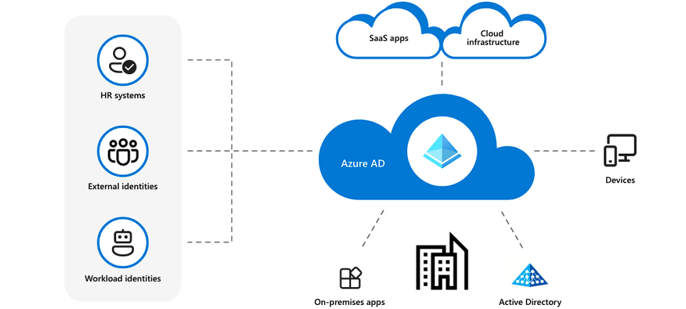
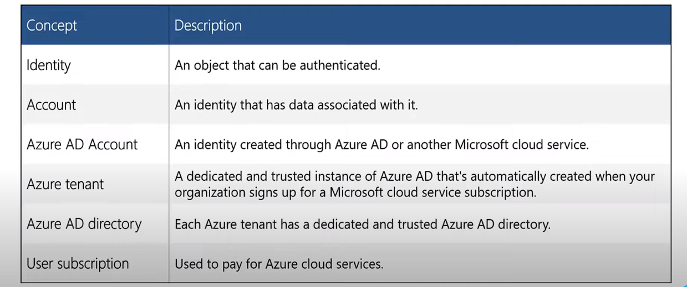
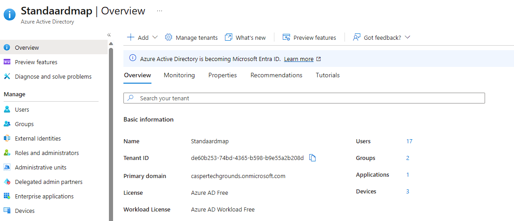
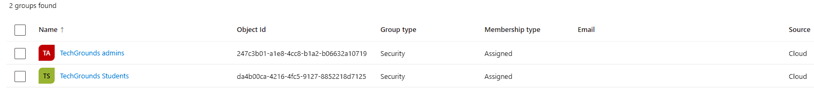
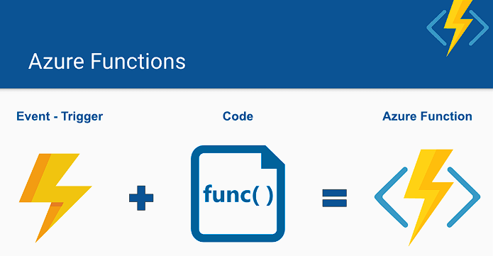
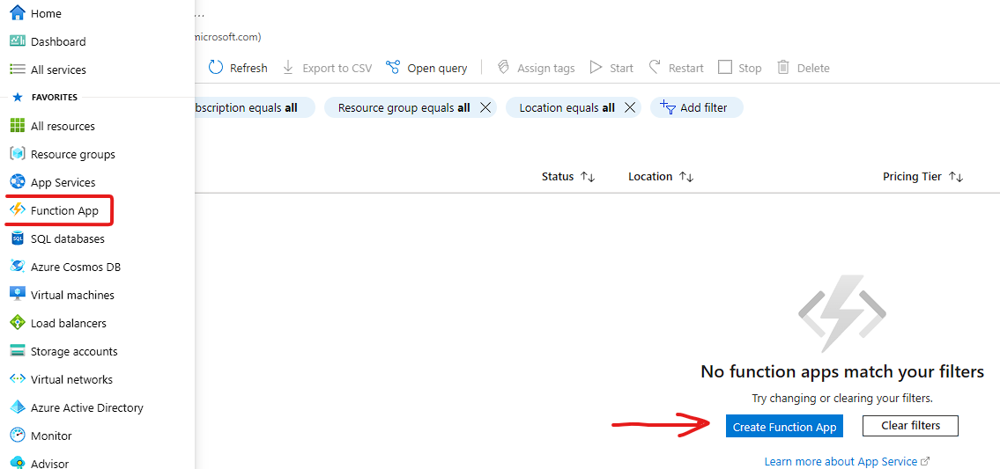
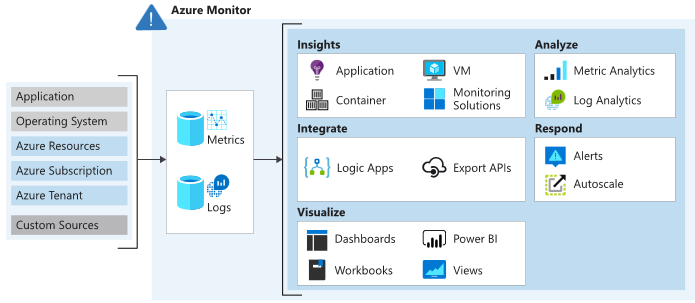

# AZ-15 - Active Directory, Monitor, CosmosDB, Functions

In this Assigment we will take a deeper dive into multiple Azure Services and its practices.  

Azure provides a wide range of apps and services that empower organizations to build, deploy, and scale their applications in the cloud. These services offer various capabilities to meet different application requirements and enable seamless development and management experiences.

## Azure Active Directory

Azure Active Directory (Azure AD) is a cloud-based identity and access management service. It acts as a centralized hub for managing user identities and controlling access to applications and resources in the cloud and on-premises. It allows you to create and manage user accounts, define roles and permissions, and enable single sign-on to various applications and services.

### (AD) - Purpose
Think of Azure Active Directory as a digital directory that keeps track of who can access what within your organization. It allows you to create and manage user accounts, define roles and permissions, and enable single sign-on to various applications and services.

- **Service Environment** -> PaaS

### Key Features
- Multi-tenant, cloud-based directory and identity management service.
- Combines core directory services, advanced identity governance, and application access management.
- Allows IT admins to give SSO to services including Microsoft 365, Salesforce.com, DropBox and Concur.
- Full suite of identity management capabilities including multi-factor authentication, device registration, self-service password management, self-service group management, privileged account management, role-based access control, application usage monitoring, auditing and security monitoring and alerting.

### Identity Management Capabilities
- Self-service password and group management
- Priviliged account management
- Role-based access control
- App usage monitoring
- Security monitoring
- Device Registration 
- Alerting
- MFA

**Azure AD Concepts** :

### Main Benefits
- Single sign-on to any cloud or on-premises web app.
- Compatible with most systems
- Protect on-premises web apps with secure remote access
- Extend AD to the cloud
- Help protect sensitive data and apps

**Multi-Factor Authentication (MFA)**
*Verification methods:*
- Something you know (typically a password)
- Something you have (a trusted device that is not easily duplicated, like a phone)
- Something you are (biometrics)

*MFA*
- Microsoft's two-step verification solution
- Verification methods includes phone call, text message, or mobile app verification.
- You grant access to users and require Azure MFA registration.
-----------------------------------------------------------
### Practical Assignment

Obviously, we as students don't have much privileges assigned to ourselfs so there is little I can show.

Overview Azure Portal AD:

Our Directory is devided into two  groups: Admins (Caper and Shikha), and the students which is the group I'm part of.

-------------------------------------------------------------------

## Azure Functions

Azure functions is a solution for easily running small pieces of code, or "functions", in the cloud. You can write just the code you need for the problem at hand, without worrying about a whole application or the infrastructure to run it.

Think of Azure Functions as small, self-contained units of code that perform specific tasks. They can be triggered by various events, such as changes in data, schedules, or external requests. These events are called triggers, and they act as the starting point for your functions.

Triggers can be things like an incoming HTTP request, changes in a storage account, messages from a queue, or timers that fire at specific intervals. When a trigger event occurs, Azure Functions automatically scales and runs your code in response to that event.

In addition to triggers, Azure Functions also provide bindings. Bindings are a way to connect your code to other Azure services or external resources. They act as input and output connections for your functions, allowing you to easily integrate with services like Azure Storage, Azure Cosmos DB, Azure Event Hubs, and more.

**Support for multiple languages**
- C#, .NET, Java, Javascript, Python, Powershell ...

### Key Features
- Pay-as-you-go pricing model
- Bring your own dependencies (NPM or NuGet)
- Integrated security 
- Highly Scalable
- Simplified integration
- Flexible development (develop in Portal or VS Code or other tools)
- Integration with Github, Azure DevOps, etc..
- Open-source

-----------------------------------------------------------------------
### Practical Assignment

Azure Functions is a service that only has a practical purpose if you have other resources which include code (apps). On itself, for our assignment this is compromised. 

Capture that displays how you find Functions on the Azure Portal interface:

-------------------------------------------------------------------------------

## Azure Monitor

Azure Monitor is a cloud monitoring service that helps you gain visibility into the performance, availability, and health of your Azure resources and applications. With Azure Monitor, you can proactively monitor, diagnose, and optimize your cloud environment.

Think of Azure Monitor as a watchful guardian that keeps an eye on your Azure resources. It collects and analyzes data from various sources, such as virtual machines, databases, applications, and networking, to provide valuable insights and alerts.

### Key Capabilities

- **Metrics** -> collects metrics, which are numerical values that measure the performance of your resources. You can visualize these metrics on dashboards and set up alerts based on specific thresholds to get notified when something goes wrong.

- **Logs** -> collects log data, which includes events, diagnostic logs, and application traces. You can use logs to gain deeper insights into the behavior of your applications and troubleshoot issues.

- **Alerts** -> allows you to configure alerts based on metric or log data. You can set up conditions and thresholds to trigger alerts when certain criteria are met. This helps you identify and respond to critical events or performance anomalies in a timely manner.

- **Dashboards** -> offers customizable dashboards where you can create visualizations of your monitored data. You can arrange charts, metrics, and logs to create a personalized view of your resources' health and performance.

- **Application Insights** ->  integrates with Application Insights, a service that helps monitor the performance and availability of your applications. It provides detailed application-level insights, including request rates, response times, and dependency tracking.

------------------------------------------------------------
### Practical Assignment

**Azure Portal - Monitor Overview Example**

-----------------------------------------------------------------

### Sources used

| Source       | Description |
| ----------- | ----------- |
| https://learn.microsoft.com/en-us/azure/active-directory/fundamentals/active-directory-whatis | MS Learn - AAD |
| https://www.youtube.com/watch?v=Ma7VAQE7ga4 | Intro on AD/AAD |
| https://learn.microsoft.com/en-us/azure/azure-functions/functions-overview?pivots=programming-language-python | Azure Functions - MS Learn |
| https://chsakell.com/2018/11/18/building-serverless-apps-with-azure-functions/ | Azure Functions in practice |
| ----------- | ----------- |
| ----------- | ----------- |
| https://learn.microsoft.com/en-us/azure/azure-monitor/overview | Azure Monitor - MS Learn |
| https://www.devopsschool.com/blog/what-is-an-azure-monitor/ | Azure Monitor - Explained |

--------------------------------------------------------------------

 

