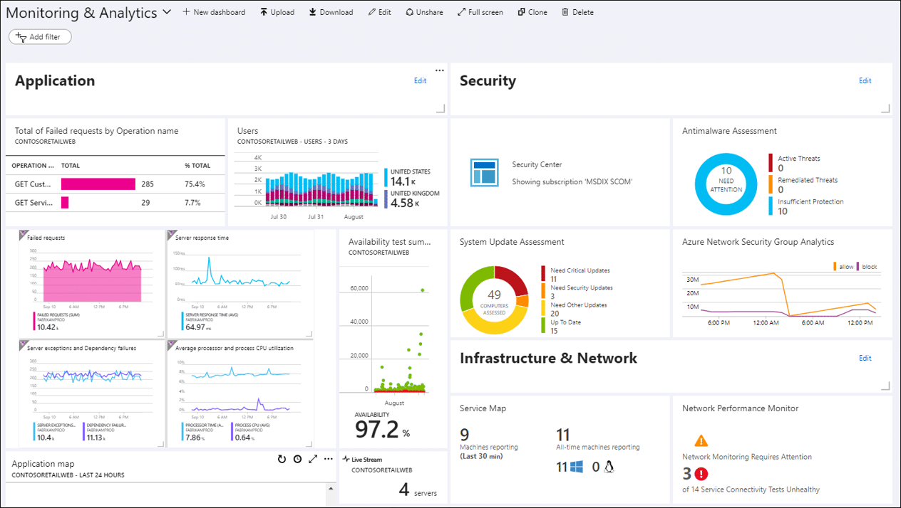

# AZ-15 - Active Directory, Monitor, CosmosDB, Functions

In this Assigment we will take a deeper dive into multiple Azure Services and its practices.  

Azure provides a wide range of apps and services that empower organizations to build, deploy, and scale their applications in the cloud. These services offer various capabilities to meet different application requirements and enable seamless development and management experiences.

## Azure Active Directory

Azure Active Directory (Azure AD) is a cloud-based identity and access management service. It acts as a centralized hub for managing user identities and controlling access to applications and resources in the cloud and on-premises. It allows you to create and manage user accounts, define roles and permissions, and enable single sign-on to various applications and services.

### (AD) - Purpose
Think of Azure Active Directory as a digital directory that keeps track of who can access what within your organization. It allows you to create and manage user accounts, define roles and permissions, and enable single sign-on to various applications and services.

- **Service Environment** -> PaaS

### Key Features
- Multi-tenant, cloud-based directory and identity management service.
- Combines core directory services, advanced identity governance, and application access management.
- Allows IT admins to give SSO to services including Microsoft 365, Salesforce.com, DropBox and Concur.
- Full suite of identity management capabilities including multi-factor authentication, device registration, self-service password management, self-service group management, privileged account management, role-based access control, application usage monitoring, auditing and security monitoring and alerting.

### Identity Management Capabilities
- Self-service password and group management
- Priviliged account management
- Role-based access control
- App usage monitoring
- Security monitoring
- Device Registration 
- Alerting
- MFA

**Azure AD Concepts** :

### Main Benefits
- Single sign-on to any cloud or on-premises web app.
- Compatible with most systems
- Protect on-premises web apps with secure remote access
- Extend AD to the cloud
- Help protect sensitive data and apps

**Multi-Factor Authentication (MFA)**

*Verification methods:*
- Something you know (typically a password)
- Something you have (a trusted device that is not easily duplicated, like a phone)
- Something you are (biometrics)

*MFA*
- Microsoft's two-step verification solution
- Verification methods includes phone call, text message, or mobile app verification.
- You grant access to users and require Azure MFA registration.
-----------------------------------------------------------
### Practical Assignment

Obviously, we as students don't have much privileges assigned to ourselfs so there is little I can show.

Overview Azure Portal AD:

Our Directory is devided into two  groups: Admins (Caper and Shikha), and the students which is the group I'm part of.

-------------------------------------------------------------------

## Azure Functions

Azure functions is a solution for easily running small pieces of code, or "functions", in the cloud. You can write just the code you need for the problem at hand, without worrying about a whole application or the infrastructure to run it.

Think of Azure Functions as small, self-contained units of code that perform specific tasks. They can be triggered by various events, such as changes in data, schedules, or external requests. These events are called triggers, and they act as the starting point for your functions.

Triggers can be things like an incoming HTTP request, changes in a storage account, messages from a queue, or timers that fire at specific intervals. When a trigger event occurs, Azure Functions automatically scales and runs your code in response to that event.

In addition to triggers, Azure Functions also provide bindings. Bindings are a way to connect your code to other Azure services or external resources. They act as input and output connections for your functions, allowing you to easily integrate with services like Azure Storage, Azure Cosmos DB, Azure Event Hubs, and more.

**Support for multiple languages**
- C#, .NET, Java, Javascript, Python, Powershell ...

### Key Features
- Pay-as-you-go pricing model
- Bring your own dependencies (NPM or NuGet)
- Integrated security 
- Highly Scalable
- Simplified integration
- Flexible development (develop in Portal or VS Code or other tools)
- Integration with Github, Azure DevOps, etc..
- Open-source

-----------------------------------------------------------------------
### Practical Assignment

Azure Functions is a service that only has a practical purpose if you have other resources which include code (apps). On itself, for our assignment this is compromised. 

Capture that displays how you find Functions on the Azure Portal interface:

-------------------------------------------------------------------------------

## Azure Monitor

Azure Monitor is a cloud monitoring service that helps you gain visibility into the performance, availability, and health of your Azure resources and applications. With Azure Monitor, you can proactively monitor, diagnose, and optimize your cloud environment.

Think of Azure Monitor as a watchful guardian that keeps an eye on your Azure resources. It collects and analyzes data from various sources, such as virtual machines, databases, applications, and networking, to provide valuable insights and alerts.

### Key Capabilities

- **Metrics** -> collects metrics, which are numerical values that measure the performance of your resources. You can visualize these metrics on dashboards and set up alerts based on specific thresholds to get notified when something goes wrong.

- **Logs** -> collects log data, which includes events, diagnostic logs, and application traces. You can use logs to gain deeper insights into the behavior of your applications and troubleshoot issues.

- **Alerts** -> allows you to configure alerts based on metric or log data. You can set up conditions and thresholds to trigger alerts when certain criteria are met. This helps you identify and respond to critical events or performance anomalies in a timely manner.

- **Dashboards** -> offers customizable dashboards where you can create visualizations of your monitored data. You can arrange charts, metrics, and logs to create a personalized view of your resources' health and performance.

- **Application Insights** ->  integrates with Application Insights, a service that helps monitor the performance and availability of your applications. It provides detailed application-level insights, including request rates, response times, and dependency tracking.

------------------------------------------------------------
### Practical Assignment

**Azure Portal - Monitor Overview Example**

-----------------------------------------------------------------

## Azure Cosmos DB

Azure Cosmos DB is a fully managed **NoSQL** and **relational database** for modern app development

Azure Cosmos DB is a globally distributed, multi-model database service that is designed to handle massive amounts of data and provide low-latency access to that data from anywhere in the world. Azure Cosmos DB is a powerful solution for building highly scalable and globally available applications.

### Key Features & Benefits

- **Global Distribution**: -> It provides built-in global distribution, allowing you to replicate and distribute your data across multiple regions for low-latency access and high availability.

- **Multi-Model Support**: -> Azure Cosmos DB supports multiple data models, including document, key-value, graph, and column-family, offering flexibility to choose the right model for your application's needs.

- **Elastic Scalability**: -> You can scale Azure Cosmos DB's throughput and storage seamlessly to handle increasing data demands without downtime.

- **SLA-backed Performance**: -> Azure Cosmos DB guarantees single-digit millisecond latencies for reads and writes, ensuring fast and responsive data access.

- **Multi-API Support**: -> It offers compatibility with various APIs, such as SQL, MongoDB, Cassandra, Gremlin, and Table, allowing you to use familiar programming models and tools.

- **Security and Compliance**: -> Azure Cosmos DB provides robust security features, including encryption at rest and in transit, role-based access control, and compliance with industry standards and regulations.

- **Integrated Analytics**: -> Azure Cosmos DB integrates with Azure Synapse Analytics and Azure Databricks, enabling seamless data analysis and advanced analytics capabilities.

### Use Cases

- Web and Mobile Apps: It provides a flexible and scalable database solution for web and mobile applications that require fast and responsive data access.

- IoT (Internet of Things): Azure Cosmos DB can handle the high volume of data generated by IoT devices, providing real-time data ingestion, analytics, and querying capabilities.

- Gaming: It offers low-latency data access, which is essential for real-time gaming scenarios, such as leaderboards, matchmaking, and game analytics.

- Personalization and Recommendation Engines: Azure Cosmos DB enables storing and querying large volumes of user data to power personalized recommendations and content delivery.

## Practical Assignment

-------------------------------------------------------------------------------

## Azure Event Grid

Azure Event Grid is a fully managed event routing service that enables you to build event-driven architectures and connect various Azure services, as well as custom applications, with reliable and real-time event notifications. Azure Event Grid simplifies the process of reacting to events and building reactive, scalable applications.

### Key Features & Benefits

- **Event-driven Architecture**: -> It supports the event-driven programming model, where events are the foundation for application logic and actions. It simplifies the design and development of event-driven applications by providing a scalable and managed event routing infrastructure.

- **Scalability and Performance**: -> Azure Event Grid is built to handle massive amounts of events with low latency. It scales automatically to handle event processing, ensuring high performance and reliability.

- **Rich Event Sources**: -> It integrates with a wide range of Azure services, allowing you to capture events from various sources, including Blob Storage, Azure Functions, Azure Cosmos DB, Azure Logic Apps, and more. Additionally, you can create custom topics to publish and handle events from your own applications or services.

- **Flexible Event Routing**: -> enables you to route events to multiple event handlers or endpoints. It supports various event delivery mechanisms, including WebHooks, Azure Functions, Azure Logic Apps, and Event Hubs.

- **Filtering and Advanced Routing**: -> You can use filters to route events based on specific conditions, such as event type, subject, or custom properties. This allows for precise event routing and handling.

- **Reliable Event Delivery**: -> It provides at-least-once event delivery guarantees, ensuring that events are reliably delivered to the event handlers.

- **Cost-Effective**: -> Azure Event Grid follows a consumption-based pricing model, where you only pay for the number of events processed and delivered. This makes it a cost-effective solution, especially for event-driven architectures with varying workloads.

### Use Cases

- Serverless Applications: It allows serverless functions or workflows to respond to events triggered by different Azure services, such as Blob Storage, Azure Functions, or Azure Logic Apps.

- Microservices Communication: Azure Event Grid facilitates communication and decoupling between microservices by enabling them to send and receive events. It provides a scalable and reliable messaging mechanism for loosely coupled architectures.

- IoT (Internet of Things): Azure Event Grid enables real-time processing and event-driven architectures for IoT scenarios. It can react to device telemetry, sensor data, or command messages, triggering actions or workflows.

- Automation and Workflow Orchestration: It can be used to automate business processes and orchestrate workflows by reacting to specific events. For example, sending notifications when a new file is added to a storage account or triggering an action when a message is received.

**Eventhub vs Servicebus**

**Pricing**

**Security**

------------------------------------------------------------------------------

### Practical Assignment

---------------------------------------------------------------------------

## Queue Storage

Azure Queue Storage is a service for storing large numbers of messages.

Azure Queue Storage is a scalable and durable message queuing service provided by Microsoft Azure. It enables you to asynchronously communicate between different components of your distributed application, ensuring reliable message delivery and decoupling of sender and receiver.

### Key Features & Benefits

- **Scalability and Durability**: ->  Azure Queue Storage can handle high message throughput and automatically scales to accommodate increasing message volumes. It also provides durability by replicating messages across multiple storage nodes.

- **Asynchronous Communication**: -> It enables asynchronous communication between different components of your application, allowing them to operate independently and reducing dependencies between services.

- **Simple Queue Structure**: -> has a simple FIFO (First-In-First-Out) queue structure. Messages are added to the end of the queue and retrieved from the front, ensuring that messages are processed in the order they were added.

- **Message Time-to-Live (TTL)**: -> You can set a time-to-live for messages in the queue, specifying how long a message is retained before it expires and is automatically removed from the queue.

- **De-duplication**: -> supports message de-duplication based on the message's unique ID. This ensures that duplicate messages are identified and processed only once, preventing redundant actions.

- **Message Visibility Timeout**: -> When a message is retrieved from the queue, it becomes invisible to other consumers for a specific period (visibility timeout). This allows the consumer to process the message without interference from other consumers..

- **Cost-Effective**: -> Azure Queue Storage follows a consumption-based pricing model, where you only pay for the storage and message operations you use. This makes it a cost-effective solution, especially for scenarios with variable message loads.

### Use Cases

- Workload Decoupling: It allows you to decouple different components of your application by sending messages to a queue. This enables asynchronous processing and helps to distribute the workload across multiple workers or services.

- Event Processing: Azure Queue Storage can be used as an event source for triggering actions or workflows. You can enqueue events and have them processed by consumers to trigger specific actions or notifications.

- Task Queuing: It facilitates task management and scheduling by placing tasks in a queue. Workers or background processes can retrieve tasks from the queue and process them asynchronously, ensuring efficient task execution.

- Reliable Messaging: ensures reliable message delivery by providing at-least-once delivery guarantees. It stores messages redundantly and ensures that each message is delivered to the recipient, even in the event of failures.

------------------------------------------------------------------------------

## Azure Service Bus

Azure Service Bus is a fully managed enterprise message broker with message queues and publish-subscribe topics (in a namespace). It enables reliable and secure communication between different applications and services, both within Azure and across on-premises and cloud environments. Azure Service Bus facilitates the exchange of messages, allowing for seamless integration and coordination between distributed systems.

### Key Features & Benefits

- **Message Queues**: ->  provides reliable message queuing, ensuring at-least-once delivery guarantees. It supports First-In-First-Out (FIFO) ordering, allowing messages to be processed in the order they were added to the queue.

- **Topics and Subscriptions**: -> It enables pub-sub (publish-subscribe) messaging patterns through topics and subscriptions. Publishers can send messages to a topic, and multiple subscribers can receive relevant messages based on their subscriptions.

- **Relay Messaging**: -> offers relay messaging capabilities, allowing external applications and services to securely communicate with resources inside private networks, without requiring inbound firewall rules or VPN connections.

- **Message Transactions**: -> It supports transactional messaging, where multiple messages can be grouped together and processed as a single atomic unit. This ensures data consistency and integrity in distributed transactions.

- **Message Sessions**: -> provides session support for ordered message processing and exclusive message access. Sessions enable related messages to be processed together, ensuring message ordering and maintaining message context.

- **Dead-Letter Queue**: -> It includes a dead-letter queue where messages that couldn't be processed are sent for troubleshooting and analysis. This helps with identifying and resolving message processing issues.

- **Scalability and High Availability**: -> Azure Service Bus is a highly scalable and resilient service. It automatically scales to handle increasing message volumes and provides built-in redundancy to ensure high availability.

### Use Cases

- Event-Driven Architectures: It enables event-based communication between different components of your application. Events can be published to a topic and consumed by multiple subscribers, allowing for loosely coupled and scalable architectures.

- Application Integration: Azure Service Bus facilitates the integration of different applications and services by providing a messaging backbone. It allows for asynchronous communication, ensuring reliable message delivery and decoupling sender and receiver.

- Workload Decoupling: It helps to distribute the workload across multiple workers or services by using message queues. Work items or tasks can be placed in a queue and processed by workers independently, improving efficiency and scalability.

- Hybrid Cloud Integration: Azure Service Bus enables communication and integration between on-premises systems and cloud applications. It provides connectivity options, such as virtual network service endpoints and hybrid connections, to securely exchange messages across environments.

### Service Buses vs Storage Queues

- Metrics
  - **Request metrics** counts the number of requests.
  - **Message metrics** counts the messages (active, incoming, outgoing etc)
  - **Connection metrics** active/opened/closed messages
  - **Resource usage metrics** in Premium: CPU/memory size usage per namespace.
- Diagnostics Logs
  - E.g. • `ActivityId` • `EventName` • `resourceId` • `SubscriptionId` • `EventTimeString` • `EventProperties` • `Status` • `Caller` • `category` (= `operationalLogs`)

### Pricing

- **Premium**
Fixed size
Predictable performance
Up-down scaling
Messages up to 1 MB

- **Standard**
Standard
Elastic
Auto-scaling
Message size up to 256 KB

--------------------------------------------------------------------------

### Sources used

| Source       | Description |
| ----------- | ----------- |
| https://learn.microsoft.com/en-us/azure/active-directory/fundamentals/active-directory-whatis | MS Learn - AAD |
| https://www.youtube.com/watch?v=Ma7VAQE7ga4 | Intro on AD/AAD |
| https://learn.microsoft.com/en-us/azure/azure-functions/functions-overview?pivots=programming-language-python | Azure Functions - MS Learn |
| https://chsakell.com/2018/11/18/building-serverless-apps-with-azure-functions/ | Azure Functions in practice |
| https://learn.microsoft.com/en-gb/azure/service-bus-messaging/service-bus-messaging-overview | Azure Service Bus - MS Learn |
| https://learn.microsoft.com/en-us/azure/azure-monitor/overview | Azure Monitor - MS Learn |
| https://www.devopsschool.com/blog/what-is-an-azure-monitor/ | Azure Monitor - Explained |
| https://learn.microsoft.com/en-gb/azure/cosmos-db/introduction | CosmosDB Intro - MS Learn |
| https://learn.microsoft.com/en-us/azure/event-grid/overview | Azure Event Grid - MS Learn |
| https://learn.microsoft.com/en-us/azure/service-bus-messaging/compare-messaging-services | Messaging Services Compared - MS Learn |
| ----------- | ----------- |
| ----------- | ----------- |
| ----------- | ----------- |

--------------------------------------------------------------------

 

