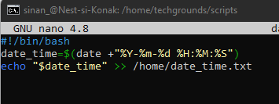
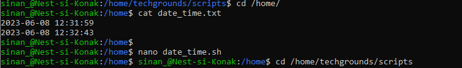
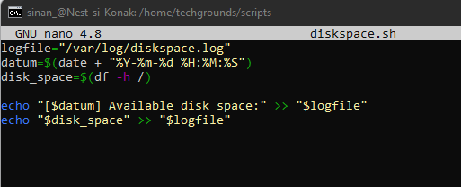

# [LNX-08-English]

## Cron Jobs

In this section, we will learn about 'Cron jobs'. A "cron job" in Linux is an automated task scheduler that runs at specified time intervals. This allows users to automate routine tasks, such as generating reports in a log file.
 

## Key-terms

- [x] <strong>Cron Job</strong> -> A task that can be invoked periodically.

## Requirements

- [x] Machine running Linux


## Assignment Description

In this assignment, we will learn how to add tasks to the cron system in Linux that will be automatically executed at specified time intervals.


## Tasks

- [x] Create a Bash script that writes the current date and time to a file in your ```\home\``` directory
- [x] Register the script in your crontab to run every minute.
- [x] Maak een script dat de beschikbare schijfruimte doorgeeft naar een logbestand in ```/var/logs```. Use a cron job to run it weekly. 


### Sources

| Source      | Description |
| ----------- | ----------- |
| https://wiki.lib.sun.ac.za/images/c/ca/TLCL-13.07.pdf  | Comprehensive documentation of the Linux command line |
| https://docs.linuxgsm.com/configuration/cronjobs | Information about the cron system and adding cron jobs |
| https://www.freecodecamp.org/news/bash-scripting-tutorial-linux-shell-script-and-command-line-for-beginners/ | A guide on Bash Scripting in Linux  |
| https://crontab.guru/  | Useful tool for setting the time interval of a cron job |


### Experienced Issues

The folder ```/logs/``` in the **var** directory needed to be created. It was a mistake because the folder ```/log``` already existed.

The file ```date_time.txt``` in the home directory had the wrong permissions assigned to it.
This was resolved by assigning the right permissions -> ```sudo chown sinan_:sinan_ date_time.txt```.


### Result
*Below you will find the images showing the results along with their descriptions*

Bash script that writes the current date and time to the file ```date_time.txt``` in the **/home** folder.



Checking if it works successfully: 



Added code line in the crontab with a one-minute time interval


Bash script for logging available disk space to ```/var/logs/diskpace.log```



For the cron job, the line ```0 0 * * 0 /home/techgrounds/scripts/diskspace.sh``` was added to the crontab.


