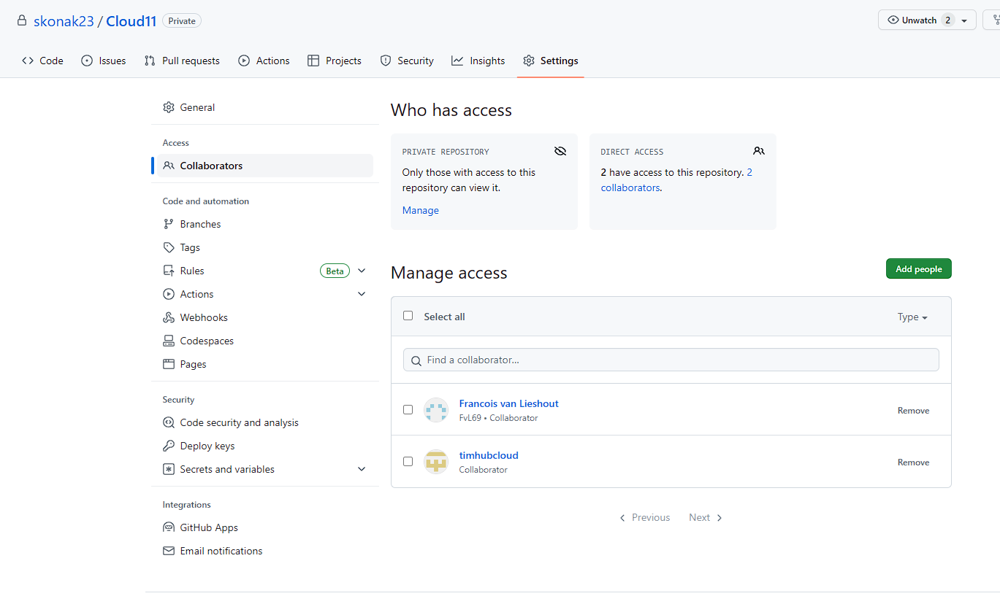

# [Git & Github]

Git is een versie beheersysteem die er op gericht is wijzigingen in bestanden te traceren en te faciliteren onder ontwikkelaars die aan een project werken.
 
Github is een web-based hosting service voor Git repositories. Het biedt een platform aan voor ontwikkelaars om code op ste slaan, te delen en samen te werken aan projecten. 

## Key-terms

- [x] Repository (repo) is een opslagplaats waar bestanden, mappen en geschiedenis van een project bewaard worden.
- [x] Main / Master is de "hoofdbranche" waar de meest robuuste en volledige versies van de code wordt bewaard.
- [x] Branch verwijst naar een zogezegde "tak" binnen een Git-repository waar wijzigingen aangebracht kunnen worden in een codebase zonder de 'Mainbranche' te beinvloeden.
- [x] Commit verwijst naar een opgeslagen wijziging van de bestanden in een repo op een bepaald tijdspunt. 
- [x] Push is een opdracht gebruikt op Git en GitHub, om veranderingen over te brengen van een lokaal repo naar een remote repo wat eventueel gezien kan worden door medeontwikkelaars.
- [x] Pull is een opdracht die wordt gebruikt om de wijzigingen van een externe repository op te halen en deze samen te voegen met de huidige lokale repository.
- [x] Merge verwijst naar de samenvoeging van wijzigingen van meerdere branches tot één branch.
- [x] Fork is een term die doelt op het maken van een persoonlijke kopie van iemand anders zijn repo.
- [x] Clone is term waarmee men doelt op het kopieren van een remote repo naar je lokale machine.

## Benodigdheden

- [x] <strong>Een GitHub account</strong> (https://github.com)
- [x] <strong>Git</strong> (https://git-scm.com/downloads)
- [x] <strong>Een teksteditor</strong> (IDE): bv. 'Visual Studio Code'

## Opdrachtbeschrijving

Doel van dit assignment is het begrijpen en toepassen van de basisprincipes van Git en Github

## Opdrachten

### Opdracht 1:

- [x] Github account aanmaken
- [x] Repository op je Github account aanmaken voor gebruik
- [x] Permissies geven aan teammates voor gebruik van jou repository
- [x] Code/bestanden naar je repo pushen
- [x] Repo van je peers pullen of clonen

### Opdracht 2:

- [x] Een nieuwe repo aanmaken voor je portfolio en de verwerking van assignments
- [x] Gemaakte notities van de assignment(s) pushen naar de repo
- [x] Het delen van de repo met je learning coach   

### Gebruikte bronnen

| Bron      | Beschrijving |
| ----------- | ----------- |
| https://www.datacamp.com/tutorial/git-push-pull     | Korte beschrijvingen van 'git' commands voor gebruik met git bash       |
| https://rogerdudler.github.io/git-guide/   | Simpele uitleg over de basisprincipes van Git        |
| https://github.com/techgrounds/git-github-fundamentals-agcdtmr | Basisinformatie over het gebruik van Github |

### Ervaren problemen

Problemen ervaren met de main en master branche waardoor 'push-commands' niet uitgevoerd werden. Opgelost door wijzigen van persoonlijke repo naar portfolio repo techgrounds. Zie onderstaande afbeelding:

### Resultaat
Hieronder ziet u de afbeeldingen die het resultaat weergeeft met bijbehorende beschrijving

Hoofdpagina account op Github en de eerste repository:

Permissies geven aan teammates voor gebruik van jou repository:

Het clonen en pushen van code naar je repository:

Een pull/clone commando van een peer repo:

Opzetten van portfolio repository voor techgrounds assignments:

Pushen van notities naar portfolio repo:

 
