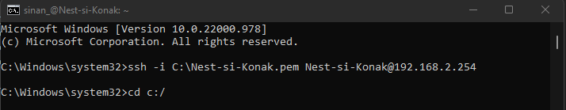

# [LNX-01]

Linux is net als Windows een besturingssysteem. Het is in de wereld van (virtuele) netwerken en servers een zeer populair systeem die bekend staat om haar lichte voetdruk, stabiliteit en aanpasbaarheid. Het maakt tevens gebruik van een open source licentie.
 

## Key-terms

- [x] <strong>GUI</strong> staat voor 'Graphical User Interface' en verwijst naar de visuele manier waarop omgegaan wordt met software of een besturingssysteem.
- [x] <strong>CLI</strong> staat voor 'Command Line Interface'. Je kunt ermee op een tekstgebaseerde manier commando's uitvoeren binnen een systeem. 
- [x] <strong>VM</strong> vertaald naar 'virtuele machine', is een software-implementatie van een computer binnen een fysieke computer.  
- [x] <strong>SSH</strong> 'Secure Shell' is een netwerkprotocol dat gebruikt kan worden om op afstand toegang te krijgen en te communiceren met andere computers.

## Benodigdheden

- [x] <strong>CLI met SSH ondersteunging</strong> 
- [x] <strong>Server and credentials info provided by LC</strong>

## Opdrachtbeschrijving

Doel van deze opdracht is een SSH-verbinding leggen met een VM d.m.v. een CLI 

## Opdrachten

- [x] Maak een SSH-verbinding met de VM.
- [x] Controleer met commando 'whoami' of de verbinding met de juiste VM correct is.

### Gebruikte bronnen

| Bron      | Beschrijving |
| ----------- | ----------- |
| https://learn.microsoft.com/en-us/windows-hardware/manufacture/desktop/factoryos/connect-using-ssh?view=windows-11  | SSH verbinding leggen met een CLI in Windows  |
| https://superuser.com/questions/1309447/how-to-secure-ssh-private-key-on-windows-10 | Permissies afstellen van een private key (.pem) |

### Ervaren problemen

Problemen ervaren met permissies van de public key. Na troubleshooten erachter gekomen dat de gebruikte root folder "c:/" niet de juisten rechten verleent om met de juiste permissies een connectie te leggen met de VM.

<strong>Oplossing:</strong> Veranderen van de rootfolder waar de key zich bevind.

### Resultaat
Hieronder ziet u de afbeeldingen die het resultaat weergeeft met bijbehorende beschrijving

Verbinding met VM successvol, volgend een identity controle met de command: **whoami** :

