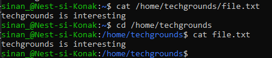

# [LNX-02]

Linux gebruikt net als andere besturingssystemen bestanden en folders. In deze assignment maken we kennis met de filesystem van Linux.
 

## Key-terms

- [x] <strong>Directory</strong> refereert naar Folder of Map 
- [x] <strong>File</strong> Bestand
- [x] <strong>Absolute Path</strong> Specificeert de volledige en exacte locatie van een bestand of map, beginnend bij de hoofdmap ("/").
- [x] <strong>Relative Path</strong> Specificeert de locatie van een bestand of directory relatief ten opzichte van de huidige werkdirectory. Het begint niet met een schuine streep ("/") en neemt de huidige directory als uitgangspunt.

## Benodigdheden

- [x] <strong>Machine draaiend op Linux</strong> 

## Opdrachtbeschrijving

Doel van deze opdracht is het leren omgaan met directories en bestanden in de CLI van Linux (Terminal)

## Opdrachten

- [x] Ontdek je huidige folder op de CLI
- [x] Geef een weergave van alle bestanden en folders in je 'home' directory.
- [x] Maak een folder genaamd 'techgrounds' aan in je home directory.
- [x] Maak een bestand aan met text in je techgrounds directory.
- [x] Wissel tussen Absolute en Relative Path

### Gebruikte bronnen

| Bron      | Beschrijving |
| ----------- | ----------- |
| https://linuxhint.com/absolute-relative-paths-linux/  | Uitleg over Absolute and Relative path |
| https://www.geeksforgeeks.org/cat-command-in-linux-with-examples/ | informatie over het maken van bestanden met text binnen CLI |

### Ervaren problemen

Problemen ervaren met permissies voor het aanmaken of wijzigen van bestanden.
<strong>Oplossing:</strong> d.m.v. **sudo chown** commando de juiste rechten ingesteld.

### Resultaat
Hieronder ziet u de afbeeldingen die het resultaat weergeeft met bijbehorende beschrijving

Huidige folder:

Home folder met lijstweergave van alle bestanden en folders:

Techgrounds folder aangemaakt:

Bestand met text aangemaakt:

Relative en Absolute weergave:

