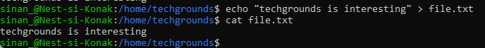

# [LNX-03]


## Het werken met tekst in CLI

In Linux CLI kun je met bepaalde commando's verwijzen naar gegevens. In deze assignment gaan we aan de slag met de verschillende commando's die in het kader van 'verwijzen'en 'verwerken' binnen de CLI te pas gaat.
 


### Key-terms

- [x] <strong>Input</strong> verwijst naar gegevens die naar een commando of proces worden gestuurd voor verwerking.
- [x] <strong>Output</strong> verwijst naar de resultaten of gegevens die worden gegenereerd door een commando en naar de terminal wordt gestuurd.
- [x] <strong>echo</strong> wordt gebruikt om tekst af te drukken of uit te voeren in de CLI
- [x] <strong>grep</strong> commando dat gebruikt wordt om tekstpatronen te doorzoeken en overeenkomende regels in bestanden te vinden in de CLI


### Benodigdheden

- [x] <strong>Machine draaiend op Linux</strong> 


### Opdrachtbeschrijving

Doel van deze opdracht is het leren omgaan met input en output direction in de CLI binnen een Linux omgeving.


### Opdrachten

- [x] Gebruik de 'echo' command en output redirection om een nieuwe zin te schrijven in je textbestand met de CLI
- [x] Weergeef de inhoud van je textbestand d.m.v. een commando in CLI. Zorg dat alleen het woord "techgrounds" in de zin weergegeven wordt.
- [x] Lees het textbestand met de commando die gebruikt is in stap 2. Redirect de output naar een nieuw bestand genaamd 'techgrounds.txt'


### Gebruikte bronnen

| Bron      | Beschrijving |
| ----------- | ----------- |
| https://www.educative.io/answers/how-to-do-input-output-redirection-in-linux  | Uitleg over input/output direction |
| https://www.guru99.com/linux-redirection.html | informatie Linux CLI m.b.t. redirection van input en output |


### Ervaren problemen

Geen.


### Resultaat
Hieronder ziet u de afbeeldingen die het resultaat weergeeft met bijbehorende beschrijving

Echo command en output redirection voor een nieuw zin in textbestand dmv ```echo "techgrounds is interesting" > file.txt```
Vervolgens wordt de inhoud van het bestand weergegeven met ```cat file.txt```




Weergave van de inhoud van een textbestand met "techgrounds" uitgelicht door toepassen van **grep** -> ```grep "techgrounds" file.txt"```


Output van een redirect naar een nieuw bestand 'techgrounds.txt':


