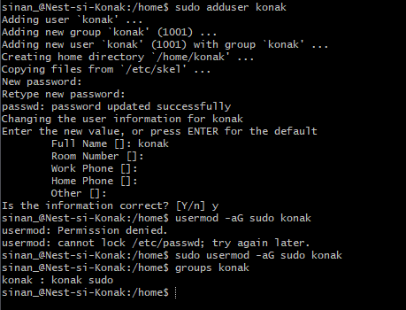
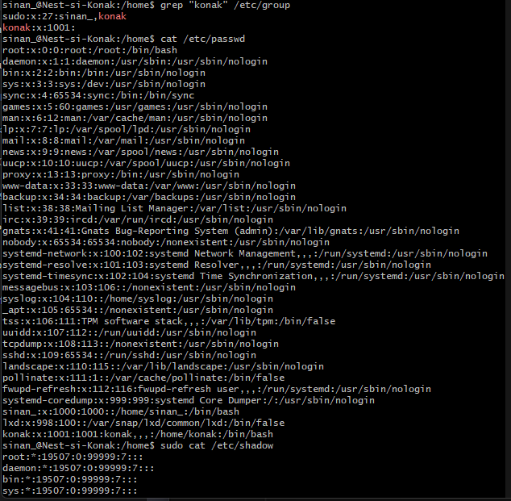

# [LNX-04]

## Gebruikers en Groepen

Op linux kun je net als bij Windows meerdere gebruikersaccounts hebben. Elke gebruiker heeft zijn eigen thuismap, en kunnen deel uitmaken van groepen.
Sommige acties vereisen root privileges. Daarvoor is er een speciale gebruiker genaamd ‘root’. Die heeft alle rechten.
Om tijdelijke rootrechten te krijgen, kun je 'sudo' voor een commando typen, maar dat werkt alleen als je dat mag doen.
Gebruikers, wachtwoorden en groepen worden allemaal opgeslagen in verschillende bestanden op het hele systeem. In dit onderdeel gaan we hier dieper op in.
 

## Key-terms

- [x] <strong>User</strong> wijst op de (huidige) gebruiker die een systeem beheert of gebruikt.
- [x] <strong>Superuser(su)</strong> Dit is de root user. De bovenliggende gebruiker met alle rechten.
- [x] <strong>Groups</strong> Gebruikers kunnen onderverdeeld worden in groepen die dezelfde rechten delen.


## Benodigdheden

- [x] Machine draaiend op Linux 


## Opdrachtbeschrijving

In deze opdracht leren we hoe een nieuwe gebruiker aangemaakt kan worden, en de rechten van deze gebruiker aangepast kunnen worden. 


## Opdrachten

- [x] Maak een nieuwe gebruiker aan in de Linux VM via de CLI. Zorg dat deze gebruiker een wachtwoord heeft en in het bezit is van root-privileges.
- [x] Localiseer de folder(s) met de bestanden waar gebruikers, wachtwoorden en groepen bewaard worden. 


### Gebruikte bronnen

| Bron      | Beschrijving |
| ----------- | ----------- |
| https://www.ionos.com/help/server-cloud-infrastructure/server-administration/creating-a-sudo-enabled-user/  | Info over het aanmaken van een user met rootrechten |
| https://linuxhint.com/where_and_how_are_passwords_stored_on_linux/ | Documentatie met info over de locatie van gebruikers, wachtwoorden en groepen. |


### Ervaren problemen

Geen.


### Resultaat
*Hieronder ziet u de afbeeldingen die het resultaat weergeeft met bijbehorende beschrijving*

Het aanmaken van een nieuwe user met wachtwoord en rootprivileges (su): ```sudo adduser konak```



Weergave van de locatie waar bestanden zijn opgeslagen met daarin gegevens zoals gebruikers, wachtwoorden en groepen: ```grep "konak" /etc/group```




