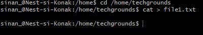
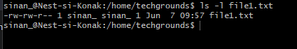
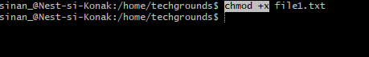
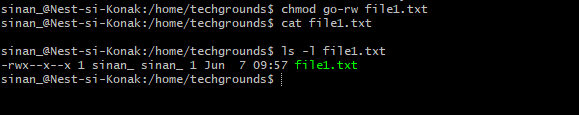
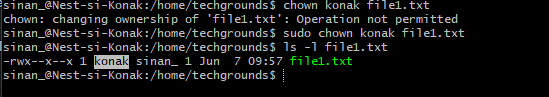
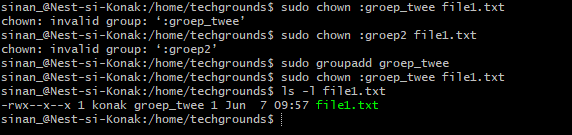

# [LNX-05]

## Machtigingen

In linux heeft elk bestand bepaalde waarden die de machtigingen weergeven. Deze machtigingen tonen of de bestanden gelezen, gewijzigd of uitgevoerd (rwx) mogen worden door een bepaald gebruiker. Ook zijn er zogenaamde 'entities' die verschillende machtigingen kunnen hebben: De eigenaar van het bestand, een groep en alle anderen. De root (su) heeft geen machtigingen nodig om een bestand te lezen, schrijven of uit te voeren. 

 

## Key-terms

- [x] <strong>file permissions</strong> -> de machtigingen die een bepaald bestand heeft.
- [x] <strong>chown</strong> -> een command die gebruikt wordt voor het veranderen van eigenaar of groep met betrekking tot een bestand.
- [x] <strong>rwx</strong> -> Voluit: r=read , w= write, x=executable
- [x] <strong>rw-</strong> -> Impliceert dat de eigenaar van het bestand het mag lezen of schrijven.
- [x] <strong>r--</strong> -> Impliceert een 'read-only' bestand voor de groep waartoe het bestand hoort.


## Benodigdheden

- [x] Machine draaiend op Linux 


## Opdrachtbeschrijving

In deze opdracht leren we hoe we een textbestand kunnen wijzigen op vlak van machtigingen, waardes en tot slot de gevolgen van het toeeigenen van het bestand naar een andere gebruiker of groep.


## Opdrachten

- [x] Maak een textbestand via de CLI
- [x] Weergeef de waardes van het bestand die info verschaffen over de eigenaar, groep en de machtigingen.
- [x] Maak het bestand "executable" door de execute (x) permissie toe te voegen
- [x] Verwijder de lees- en schrijf permissies van het bestand voor de groep en anderen, de eigenaar uitgezonderd.
- [x] Verander het bestand van eigenaar. Controleer of het bestand leesbaar is zonder root rechten.
- [x] Maak een ander (aangemaakte) groep de nieuwe eigenaar van het bestand.


### Gebruikte bronnen

| Bron      | Beschrijving |
| ----------- | ----------- |
| https://www.freecodecamp.org/news/linux-chmod-chown-change-file-permissions/  | Informatie over machtigingen van bestanden in Linux CLI. |
| https://linuxize.com/post/linux-chown-command/ | Documentatie met info over de toepassing van de **chown** command.


### Ervaren problemen

Geen.


### Resultaat
Hieronder ziet u de afbeeldingen die het resultaat weergeeft met bijbehorende beschrijving

Het maken van een textbestand in CLI: ```cat > file1.txt```



Weergave van de waardes van het textbestand ```ls -l file1.txt``` ```sinan_ sinan_``` -> opeenvolgend is dat de groep waartoe het bestand hoort, en de eigenaar. ```-rw-rw-r--``` duidt op dat het bestand **read** en **write** machtigingen heeft voor de gebruik ```sinan_```



Met behulp van ```chmod +x``` command wordt hier de execute permissie toegevoegd aan het bestand.



Hier worden de read en write permissies van het bestand voor de groep en anderen verwijderd. Alleen de eigenaar heeft deze permissies. Uitgevoerd met ```chmod go-rw file1.txt```



De eigenaar van het bestand wordt met behulp van ```sudo chown konak file1.txt``` commando veranderd naar de gebruiker genaamd 'konak'. Om dit te veranderen waren root privileges vereist, vandaar de toevoeging **sudo**



Hier wordt de textbestand toegeëigend naar een nieuw aangemaakt groep -> ```sudo chown :groep_twee file1.txt```
De nieuwe groep moet eerst wel aangemaakt worden met ```sudo groupadd groep_twee```




