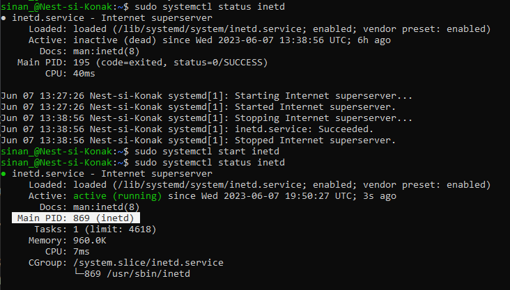
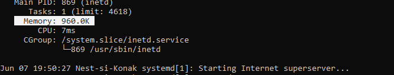
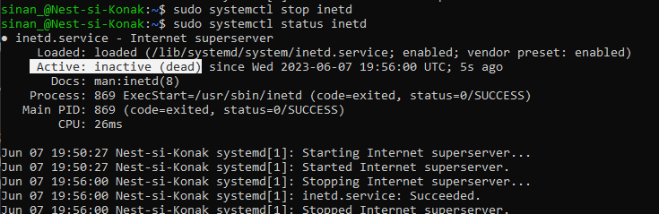

# [LNX-06]

## Processen

Processen in Linux kunnen onderverdeeld worden onder: Daemons, services en programma's.
Men gebruikt hedendaags voornamelijk de 'secure shell' (ssh) om op een versleutelde manier in te loggen op een remote computer of server. In het verleden werd daar 'telnet' voor gebruikt wat hetzelfde concept is, met als verschil dat de verbinding onversleuteld is, en dus minder veilig. In dit onderdeel gaan we aan de slag met dat laatste (telnet).

 

## Key-terms

- [x] <strong>ssh</strong> -> Secure Shell. Protocol om versleuteld te verbinden met een remote server of computer.
- [x] <strong>telnet</strong> -> Oudere protocol waarme onversleuteld verbinding wordt gemaakt met een remote server of computer.
- [x] <strong>Daemons</strong> -> een proces die op de achtergrond actief is binnen UNIX-based systemen.
- [x] <strong>Services</strong> -> processen die op de voorgrond actief zijn binnen UNIX-based systemen.
- [x] <strong>PID</strong> -> Process identification. Een identificatienummer van een proces in Linux.

## Benodigdheden

- [x] Machine draaiend op Linux 


## Opdrachtbeschrijving

In deze opdracht leren we hoe we een telnet daemon kunnen opstarten in Linux via CLI. Daarnaast leren we hoe de PID en het geheugengebruik van dit process kunnen weergeven. Tot slot leren we hoe we het telnet process kunnen beeindigen. 


## Opdrachten

- [x] Start de telnet daemon.
- [x] Zoek uit hoe de PID van de daemon kan worden afgelezen
- [x] Zoek uit hoeveel geheugen de telnet daemon verbruikt. 
- [x] Stop de telnet daemon.


### Gebruikte bronnen

| Bron      | Beschrijving |
| ----------- | ----------- |
| https://www.ibm.com/docs/en/aix/7.2?topic=t-telnetd-daemon  | Informatie over telnet daemon en de opzet hiervan |
| https://askubuntu.com/questions/668725/how-can-the-telnet-service-on-ubuntu-server-14-04-lts-be-enabled | Ubuntu forum met praktijkvoorbeelden voor het opstarten/stopzetten van een telnet daemon |
| https://man7.org/linux/man-pages/man1/ps.1.html | Definities en syntaxes voor aflezen van o.a. PID |


### Ervaren problemen

Het was in eerste instantie niet duidelijk of telnet op de VM voorgeinstalleerd was of niet omdat het een oudere protocol betreft. Dit bleek niet zo te zijn. Opgelost door het installeren van de benodigde packages: ```sudo apt install telnetd``` 


### Resultaat
*Hieronder ziet u de afbeeldingen die het resultaat weergeeft met bijbehorende beschrijving*

Opstarten van telnet daemon met commando ```sudo systemctl start inetd```


Weergave van de status en statistieken van telnet daemon met commando ```sudo systemctl status inetd```
De PID is in het wit highlighted.



Iets verder naar beneden wordt het huidige geheugengebruik weergegeven *highlighted in wit*



Tot slot wordt telnet daemon beeindigd met ```sudo systemctl stop inetd``` 
*inactive highlighted in wit*

