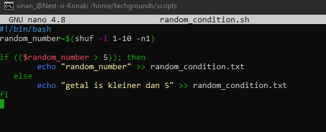

# [LNX-07]

## Scripts in Bash

In dit onderdeel maken we kennis met het schrijven en uitvoeren van 'bash scripts'. In Linux is 'Bash shell' een onmisbaar omgeving die toegang geeft tot alle componenten van het besturingssysteem. Het is een op CLI gebaseerd programma waar met behulp van commando's wisselwerkingen met het systeem kunnen worden toegpast.

In plaats van elke keer de opdrachten één voor één in te typen, kun je een script maken waarin deze opdrachten zijn opgenomen. Het script kan dan worden uitgevoerd en zal taken automatisch voor je uitvoeren.

 

## Key-terms

- [x] <strong>Bash shell</strong> -> CLI omgeving waar m.b.v. commando's opdrachten uitgevoerd kunnen worden in een Unix-based systeem.  
- [x] <strong>Script</strong> -> Verzameling instructies/opdrachten om een reeks taken te automatiseren.
- [x] <strong>httpd</strong> -> Een daemon wat gebruikt wordt om een webserver te implementeren. Apache HTTP is een breed toegepast variant van dit concept.


## Benodigdheden

- [x] <strong>Machine draaiend op Linux</strong> 


## Opdrachtbeschrijving

In deze opdracht leren we hoe we scripts kunnen schrijven en uitvoeren met behulp van Bash. 


## Opdrachten

### Opdracht 1
- [x] Maak een folder genaamd scripts. Plaats alle gemaakte scripts in deze folder.
- [x] Voeg de scripts toe aan de variabele "PATH"
- [x] Maak een script dat een regel tekst toevoegt aan een tekstbestand wanneer het wordt uitgevoerd. 
- [x] Maak een script dat het httpd-pakket installeert, httpd activeert en httpd inschakelt. Zorg dat   de script de status van httpd weergeeft.

### Opdracht 2
- [x] Maak een script dat een willekeurig getal tussen 1 en 10 genereert, dit opslaat in een variabele en het getal vervolgens toevoegt aan een tekstbestand.

### Opdracht 3
- [x] Maak een script dat een willekeurig getal tussen 1 en 10 genereert, het opslaat in een variabele en het getal alleen aan een tekstbestand toevoegt als het getal groter is dan 5. Als het getal 5 of kleiner is, moet er een regel aan worden toegevoegd van tekst naar datzelfde tekstbestand.


### Gebruikte bronnen

| Bron      | Beschrijving |
| ----------- | ----------- |
| https://wiki.lib.sun.ac.za/images/c/ca/TLCL-13.07.pdf  | Volledige documentatie van de linux commandline |
| https://linuxhint.com/generate-random-number-bash/ | Info over het genereren van willekeurige nummers met behulp van scripts in Bash |
| https://www.freecodecamp.org/news/bash-scripting-tutorial-linux-shell-script-and-command-line-for-beginners/ | Een gids over Bash Scripting in Linux  |


### Ervaren problemen

De machtigingen gegeven aan het tekstbestand voor opdracht 2 **random_txt.txt** voldeden niet. Opgelost mbv ```sudo chmod 755 random_txt.txt```

In het bash script voor opdracht 3 was er een regel met een spelfout waardoor ik de foutmelding 'line 4: 8: kreeg. Dit was na ontdekking snel opgelost.


### Resultaat
*Hieronder ziet u de afbeeldingen die het resultaat weergeeft met bijbehorende beschrijving*

Maken van een **scripts** folder. Alle scriptbestanden plaatsen we hier. ```mkdir scripts```


Scripts folder wordt toegevoegd aan de variabele 'PATH' -> ```export PATH="/scripts:$PATH"


Een bash script die de regel ```"hallo dit is een zin"``` aan het tekstbestand text1.txt als het uitgevoerd wordt.
```echo "hallo dit is een zin" >> /text1.txt```


Ter controle na uitvoering ```cat text1.txt``` -> succesvol resultaat.


Bash script met de instructies voor het installeren, activeren en aanzetten van httpd (apache).

```sudo apt update``` -> *om pakketinformatie van alle geconfigureerde bronnen te downloaden*

```sudo apt install -y apache2``` -> *het installeren van daemon httpd server*

```sudo systemctl start apache2``` -> *opstarten van de daemon (httpd) apache2*

```sudo systemctl enable apache2``` -> *activeren van apache2*

```sudo systemctl status apache2``` -> *status weergeven van apache2 httpd*


Weergave van de status van de Apache HTTP server na uitvoering van de script.


---------------------------------------------------------------------------------


Bash script die voldoet aan de voorwaarden gevraagd in Opdracht 2


Controle of het succesvol werkt: 


----------------------------------------------------------------------------------

Bash script die voldoet aan de voorwaarden gevraagd in Opdracht 3
De gevraagde conditions zijn ingevoerd. Als het willekeurige getal groter is dan '5' print dan uit. Anders print ```getal is kleiner dan 5```



Controle of het succesvol werkt:


