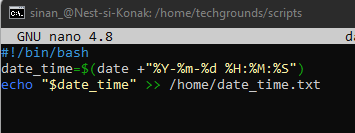
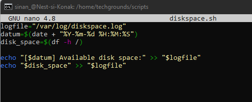

# [LNX-08]

## Cron Jobs

In dit onderdeel maken we kennis met 'Cron jobs'. Een "cron job" in Linux is een geautomatiseerde taakplanning die in bepaalde tijdsintervallen wordt uitgevoerd. Dit stelt gebruikers in staat om routinetaken te automatiseren, zoals bijvoorbeeld het genereren van rapporten in een logbestand.
 

## Key-terms

- [x] <strong>Cron Job</strong> -> Een taak die periodiek kan worden aangeroepen.

## Benodigdheden

- [x] Machine draaiend op Linux 


## Opdrachtbeschrijving

In deze opdracht leren we hoe we in het cron-systeem in Linux taken kunnen toevoegen die automatisch binnen een bepaald tijdsinterval uitgevoerd worden. 


## Opdrachten

- [x] Maak een Bash-script dat de huidige datum en tijd naar een bestand in je ```\home\``` directory schrijft.
- [x] Registreer het script in je crontab zodat het elke minuut draait.
- [x] Maak een script dat de beschikbare schijfruimte doorgeeft naar een logbestand in ```/var/logs```. Gebruik een cronjob zodat deze wekelijks wordt uitgevoerd. 


### Gebruikte bronnen

| Bron      | Beschrijving |
| ----------- | ----------- |
| https://wiki.lib.sun.ac.za/images/c/ca/TLCL-13.07.pdf  | Volledige documentatie van de linux commandline |
| https://docs.linuxgsm.com/configuration/cronjobs | Info over het cron-systeem en het toevoegen van cronjobs |
| https://www.freecodecamp.org/news/bash-scripting-tutorial-linux-shell-script-and-command-line-for-beginners/ | Een gids over Bash Scripting in Linux  |


### Ervaren problemen

De folder ```/logs/``` in de **var** directory moest nog aangemaakt worden. Een vergissing omdat de folder **log** wel bestond.

Het bestand ```date_time.txt``` in de home directory had de verkeerde permissies.
Opgelost mbv ```sudo chown sinan_:sinan_ date_time.txt```.


### Resultaat
*Hieronder ziet u de afbeeldingen die het resultaat weergeeft met bijbehorende beschrijving*

Bash script dat de huidige datum en tijd schrijft naar het bestand ```date_time.txt``` in de home folder



Controle of het succesvol werkt: 


Regel code toegevoegd in het crontab met tijdsinterval van een minuut


Bash script voor het loggen van beschikbare ruimte naar ```/var/logs/diskpace.log```



Voor de cron job is de regel ```0 0 * * 0 /home/techgrounds/scripts/diskspace.sh``` toegevoegd in het crontab 


