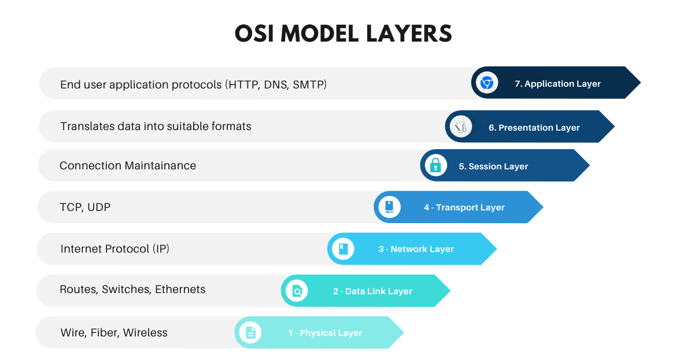

# NTW-01 - OSI model & TCP/IP model

The Open Systems Interconnection (OSI) model and the Transmission Control Protocol/Internet Protocol (TCP/IP) model are both frameworks used in computer networking to understand how information is transmitted over networks. 

The OSI model is a conceptual model that divides network communication into seven different layers, each with a specific function. It starts with the physical layer, which deals with the actual transmission of data, and progresses up to the application layer, where network applications like email and web browsing operate.

The TCP/IP model is a model widely used on the internet. It is based on a set of protocols that allow devices to communicate over networks. The TCP/IP model consists of four layers: network interface, internet, transport, and application. It enables secure and efficient data transfer between different devices and applications.

## Key-terms

- [x] <strong>OSI</strong> -> The Open Systems Interconnection (OSI) model is a conceptual framework that devides the functions of a communication system into seven different layers. Each layer has a specific purpose and interacts with the layers above and below it.
- [x] <strong>TCP/IP</strong> -> The Transmission Control Protocol/Internet Protocol (TCP/IP) model is a widely used networking model that is based on the protocols and technologies used on the internet. It is a simpler and more practical model compared to the OSI model.
- [x] <strong>bottom-up</strong> -> Focuses on the lower layers of the OSI model, such as the physical, data link, and network layers, before moving on to the higher layers.
- [x] <strong>top-down</strong> -> Focuses on the higher layers of the OSI model, such as the application, presentation, and session layers, before moving down to the lower layers.

## Sources
| Source      | Description |
| ----------- | ----------- |
| https://www.freecodecamp.org/news/osi-model-computer-networking-for-beginners/  | OSI and networking article |
| https://www.javatpoint.com/osi-vs-tcp-ip | Article that explains the differences between TCP/IP and OSI |

### The seven layers of the OSI stack: 

- [x] 1 -> **Physical Layer**: This layer deals with the physical transmission of data over a network, and physical aspects of the network.
- [x] 2 -> **Data Link Layer**: The data link layer provides data transmission between nodes on the same network segment. It also handles flow control and handles framing, error detection, and data acknowledgment.
- [x] 3 -> **Network Layer**: The network layer focuses on the logical addressing of devices on a network and handles the routing of data packets between different networks. It determines the best path for data transmission.
- [x] 4 -> **Transport Layer**: The transport layer ensures reliable data transfer between end systems. It handles segmentation and reassembly of data, flow control, and error recovery.
- [x] 5 -> **Session Layer**: The session layer establishes, manages, and terminates communication sessions between applications on different devices. It allows synchronization and checkpointing of data transfer.
- [x] 6 -> **Presentation Layer**: This layer handles the formatting, encryption, and compression of data that is transfered on the network. It ensures that data is presented in a format that the application layer can understand.
- [x] 7 -> **Application Layer**: The application layer provides services directly to the end-users. It enables network applications to access the network so that you can use it for services such as email, file transfer, and remote login.

### The four layers of the TCP/IP stack: 

- [x] 1 -> **Network Interface Layer**: This layer corresponds to the combination of the physical and data link layers in the OSI model. It deals with the physical transmission of data and provides protocols for data link control.
- [x] 2 -> **Internet Layer**: The internet layer is equivalent to the network layer in the OSI model. It handles the addressing and  routing of data packets over an IP network.
- [x] 3 -> **Transport Layer**: The transport layer is similar to the transport layer in the OSI model. It provides reliable data transfer between systems using protocols like TCP.
- [x] 4 -> **Application Layer**: The application layer in the TCP/IP model combines the functionalities of the session, presentation, and application layers in the OSI model. It encompasses all the protocols and services needed for specific applications to communicate over the network, such as HTTP (Hypertext Transfer Protocol), FTP (File Transfer Protocol), and DNS (Domain Name System).

**TCP/IP--vs--OSI** :

