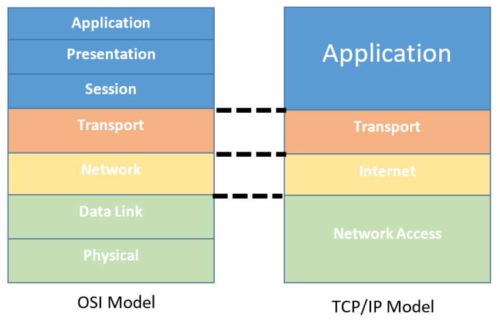

# NTW-02 - Network Devices

In computer networks, various devices work together to enable communication and the exchange of information. These network devices play different roles and have specific functions to ensure the smooth operation of networks. In this assignment we will take a deeper dive into common network devices and how they correspond to the OSI-model. To conclude, we will take a look in my own network environment and access my router to discover and gather certain network data required for this assignment.


## Key-terms (with regards to the OSI-model) 
- [x] <strong>Network Interface Card (NIC)</strong> -> Often integrated into a computer or device and operates at the physical layer (Layer 1) of the OSI model. It provides the physical interface between the device and the network medium, enabling the transmission and reception of data signals.
- [x] <strong>Repeater</strong> -> A network device that operates at the physical layer (Layer 1). It receives weak signals and amplifies them to extend the reach of the network over longer distances.
- [x] <strong>Switch</strong> -> A network device that operates at the data link layer (Layer 2). It provides data forwarding by examining MAC addresses of data packets and creating paths between devices within a network
- [x] <strong>Router</strong> -> A network device that functions at the network layer (Layer 3). It examines the IP addresses of data packets to determine the best path for forwarding them between different networks or subnets. 
- [x] <strong>Dynamic Host Configuration Protocol (DHCP)</strong> -> A protocol that assigns IP addresses to network devices on a LAN. In the OSI-model this protocol belongs to Layer 3 and 4.
- [x] <strong>gateway</strong> -> Is the IP address of the router that will deal with IP's that are outside of a particular network.


## Requirements

- [x] Your own network
- [x] OSI-model related to your network-devices


## Tasks

- [x] Name and describe the functions of common network equipment
- [x] Most routers have an overview of all connected devices, find this list. What other information does the router have about connected equipment?
- [x] Where is your DHCP server on your network? What are the configurations of these?


### Sources used

| Bron        | Beschrijving |
| ----------- | ----------- |
| https://www.pcmag.com/how-to/how-to-access-your-wi-fi-routers-settings | Information about accessing your home router |
| https://blog.netwrix.com/2019/01/08/network-devices-explained/ | Comprehensive guide that explains network devices |


### Problems experienced

None.


### Result
*Below you will find the images showing the results along with their descriptions*

Overview of the homepage of my home network router where we can see the connected devices which are present in the second column. The blue circle refers to this laptop. ```laptop ip adress = 192.168.2.15```



XXXXXX

!


 
