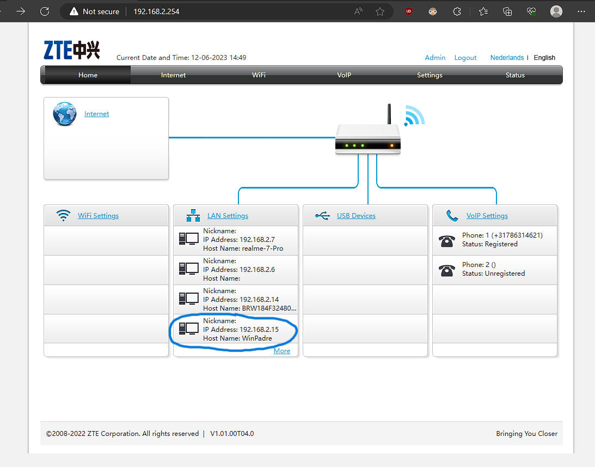
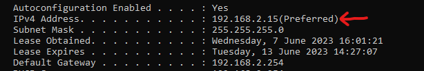
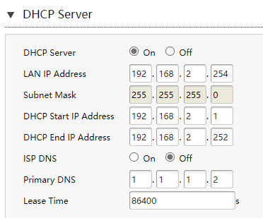

# NTW-03 - Protocols

Protocols are like sets of rules that computers and devices use to communicate and understand each other over networks. They define how data is sent and received, ensuring that information is transmitted correctly. Think of protocols as a language that devices speak to talk to each other. They specify things like how to start and end a conversation, how to address messages, and how to handle errors. Different protocols serve different purposes, like accessing websites (HTTP), or transferring files (FTP).


## Key-terms (in regard to OSI-model) 
- [x] <strong>TCP</strong> (Transmission Control Protocol) -> Layer 4 (Transport Layer). A protocol for sending and receiving data between client and server. Reliable because it requires a connection before data can be sent.
- [x] <strong>UDP</strong> (User Datagram Protocol) -> Layer 4 (Transport Layer). A protocol for sending and receiving data between client and server. Faster but less reliable because it uses connectionless transmission.
- [x] <strong>IP</strong> (Internet Protocol) -> Layer 3 (Network Layer), This protocol assigns IP addresses to devices connected to the internet and helps with identifying and locating these devices. 
- [x] <strong>HTTP</strong>  (Hypertext Transfer Protocol) -> Layer 7 (Application Layer), this protocol ensures reliable communication between a webclient (eg. a browser) and a webserver.
- [x] <strong>ARP</strong> (Address Resolution Protocol) -> Layer 2 (Data link Layer), protocol that helps devices in a local network find each other. In this process the protocol translates the IP address to a fixed physical machine address, Media Access Control (MAC) address.
- [x] <strong>Ethernet</strong> -> Layer 1 (Physical Layer), protocol used to physically connect devices together in a local area network (LAN).
- [x] <strong>NetBIOS</strong> (Network Basic Input/Output System) -> Layer 5 (Session Layer), an older protocol that helps devices in a LAN communicate with each other. Additionally it assigns (host) names to devices in a network. Routers aren't able to use this, hence it is seldomly used nowadays.
- [x] <strong>TLS</strong> (Transport Layer Security) -> Layer 6 (Presentation Layer), is a cryptographic protocol that provides data integrity and security by encrypting data that is communicated over the internet.   


## Requirements

- [x] Wireshark


## Tasks

- [x] Identify several other protocols and their associated OSI layer. Name at least one for each layer. **see key-terms**
- [x] Figure out who determines what protocols we use and what is needed to introduce your own protocol.
- [x] Look into wireshark and install this program. Try and capture a bit of your own network data. Search for a protocol you know and try to understand how it functions.


### Sources used

| Bron        | Beschrijving |
| ----------- | ----------- |
| https://www.guru99.com/layers-of-osi-model.html | Information about OSI and associated Protocols |
| https://www.w3schools.in/types-of-network-protocols-and-their-uses | Types of Network Protocols and their uses |
| https://www.cse.wustl.edu/~jain/tutorials/ftp/airtel.pdf | Comprehensive intro into Computer Networking and Protocols |
| https://www.ietf.org/standards/process/ | The process of creating a standard (protocol) |


### Problems experienced

None.


### Result(s)
*Below you will find the images showing the results along with their descriptions*

See **Key-terms** for protocols and their associated OSI layer.

Various networking or information technology organizations typically create network protocols in accordance with industry standards. The following organizations have defined and published different network protocols:
- [x] The International Organization for Standardization (ISO)
- [x] The Institute of Electrical and Electronics Engineers (IEEE)
- [x] The World Wide Web Consortium (W3C)
- [x] The International Telecommunications Union (ITU)
- [x] The Internet Engineering Task Force (IETF)

In order to introduce your own protocol, one must follow the processes for creating a standard:
- Having a clear and concise document that outlines the purpose, functionality and specifications.
- Developing the protocol (Writing the code).
- Prior implementation and testing.
- Reviewing several iterations by the Internet community and experts.
- Final revision based upon experience. If agreed upon by all parties -> The new protocol may be published. 




Other information the router has about connected equipment -> *Host Name* 

DHCP server can be found via either Command Prompt ```ipconfig /all```. Or by accessing the router DHCP settings.

DHCP server : 192.168.2.254

Command Prompt:



Router DHCP settings:




 
