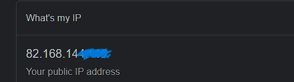

# NTW-05 - IP adresses

In this Assigment we will take a deeper dive into the concept of IP addresses.

IP addresses are like unique identifiers assigned to devices connected to a network, allowing them to communicate with each other over the internet. The most commonly used version is IPv4, which consists of a series of numbers separated by periods, like 192.168.0.1.

These addresses are made up of bits and bytes, which are units used to represent and store data. Each IP address is divided into four groups of numbers, with each group ranging from 0 to 255. For example, an IP address might be ```192.168.2.15```, where each group can have a value between 0 and 255.

Furthermore, IP addresses can be classified as private or public. Private IP addresses are used within a local network and are not accessible from the internet. Public IP addresses, on the other hand, are assigned to devices directly connected to the internet and can be used for communication across different networks. 

IP addresses can also be static or dynamic. A static IP address remains the same over time and is manually assigned to a device. It is ideal for servers or devices that need a consistent address. Dynamic IP addresses, on the other hand, are automatically assigned by a server and can change periodically. They are commonly used by devices in home networks or offices.


## Key-terms
- [x] <strong>IP address</strong> -> An IP address is a unique set of numbers assigned to a device that identifies it on a network.
- [x] <strong>IPv4</strong> (Internet Protocol version 4) ->  Fourth version and the most common one, it consists of a 32-bit number written as a series of four numbers separated by periods. Each number can range from 0 to 255. (e.g. 192.168.255.255)
- [x] <strong>IPv6</strong> (Internet Protocol version 6) -> The most recent version of Internet Protocol which uses a 128-bit address format, represented as eight groups of four hexadecimal digits seperated by colons. 
However, (2001:0db8:0000:0000:0000:8a2e:0370:7334) ---> this can be simplified into (2001:db8::8a2e:370:7334) , by omitting the groups consisting of only zeros.
- [x] <strong>Public IP</strong> -> Assigned to a device directly connected to the internet, allowing it to be identified and accessed from anywhere on the web.
- [x] <strong>Private IP</strong> -> Used within a local network (e.g. Home) Private IP addresses are reserved for internal use and are not unique globally. They allow devices within the same network to communicate with each other privately, while a router or gateway manages the connection to the internet using a public IP address.
- [x] <strong>Static IP</strong> -> Is manually assigned to a device and remains constant over time. It is configured by an administrator and does not change unless modified. Static IP addresses are typically used for devices that require a fixed, consistent address, such as servers or network printers
- [x] <strong>Dynamic IP</strong> -> Is automatically assigned by a server or router. When a device connects to the network, it is assigned an available IP address from a pool of addresses. Dynamic IP addresses are temporary and can change each time a device connects to the network. Commonly used in networks with frequent device connections and where automatic IP address management is desired.
- [x] <strong>NAT</strong> Network Address Translation ->  Is a technique used in computer networks to translate IP addresses between private and public networks. It enables multiple devices within a private network to share a single public IP address and provides security and connectivity benefits.


## Requirements

- [x] Laptop
- [x] Mobile Phone
- [x] Admin access to your router


## Tasks

- [x] Discover the public ip address of your laptop and pohone on wifi, are they the same? Explain why.
- [x] Discover the private ip address of your laptop and phone on wifi, are they the same? Explain why.
- [x] Change the private IP address of your phone into the private IP your laptop uses. What happens then?
- [x] Try changing the private IP address of your phone to an address outside of your network. What happens then?


### Sources used

| Bron        | Beschrijving |
| ----------- | ----------- |
| https://faculty.ksu.edu.sa/sites/default/files/images/16209/chapter-8.pdf | CompTIA Network+ - IP addressing documentation |
| https://geekflare.com/understanding-ip-address/ | Guide about IP addresses |


### Problems experienced

None.


### Result(s)
*Below you will find the images showing the results along with their descriptions*

Your can find your Public IP by simply googling *"what is my ip"* and it will provide your address.

- When performing this task on the laptop and phone, it gives the same result. This is because when these devices send data packets to the internet, the router replaces their private IP addresses with the single public IP address assigned to your router. Hence, every device at home corresponding with your router will share same public IP address.



The private IP address of my laptop and phone differ from each other. Laptop = ```192.168.2.15```   Phone = ```192.168.2.2```

This is to ensure unique identification within the local network. The *NAT* function on my router assigns a unique private IP address to each device within the network, provided that the corresponding devices don't have a *static ip* address set on them, and *DHCP* on your router is enabled. Having different private IP addresses for each device enables the router to differentiate between devices and route data packets accurately within the local network. "NAT" makes sure that responses from external networks are delivered to the correct device within the local network.

If I assign the same private IP address to my laptop as well as my phone, one of them refuses to communicate with the internet. This is because in this case an IP conflict is present. Routers usually have mechanisms to detect IP conflicts, if detected, it may deny access to the internet for the particular devices using the same private IP-address.

When changing the private IP address of my phone to an address outside of my network, it cause loss of network connectivity. 
This happens because your Router has been configured with a designated Local IP range (e.g.) ```[192.168.0.0]``` to ```[192.168.0.255]```  

If you manually assign a private IP address to your device outside of this range (e.g.) ```192.168.2.2```, it will result in loss of network connectivity because of a routing conflict. 


