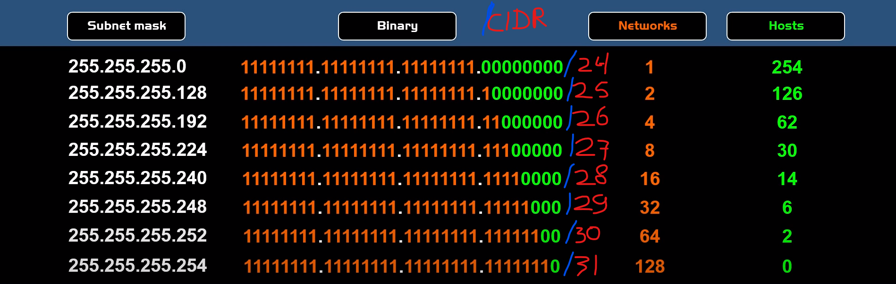

# NTW-06 - Subnetting

In this Assigment we will take a deeper dive into the concept of Subnetting.

Subnetting is a technique used in computer networking to divide a large network into smaller, more manageable parts called subnets. Each subnet consists of a range of IP addresses that can be assigned to devices within that subnet.

When subnetting, we use a subnet mask to determine the network and host portions of an IP address. The subnet mask is a sequence of numbers, usually represented in dotted decimal notation, that specifies the network size and identifies the host portion of an IP address. 

Subnetting enables the creation of private and public subnets. A private subnet is typically used for internal network devices, such as computers, printers, and servers, and is not directly accessible from the internet. On the other hand, a public subnet allows devices to have direct internet connectivity.


## Key-terms

- [x] <strong>Subnet</strong> ->  A subnet refers to a smaller division or subdivision of a larger network. It helps organize and manage IP addresses within a network by creating smaller groups or subgroups.
- [x] <strong>Subnet Mask</strong> -> Reveals how many bits in the ip address are used for the network by "masking" the network portion of the IP address. 
- [x] <strong>Default Gateway</strong> -> A device (e.g. Router) that let's devices from one network, communicate with devices on another network. (In this context, "Default" means that the designated device is the first option that's looked upon when data needs to exit the network.)
- [x] <strong>CIDR</strong> (Classless Inter-Domain Routing) ->
- [x] <strong>Host Address</strong> -> the last Octet of an IP-address e.g. 192.168.1.**128**
- [x] <strong>Network address (portion)</strong> -> The first three Octets of an IP-address e.g. **192.168.1**.0  
- [x] <strong>Host Address (portion)</strong> -> The last Octet of an IP-address e.g. 192.168.1.**128**

- [x] <strong>Network ID</strong> -> First IP-address in each Subnet.
- [x] <strong>Broadcast IP</strong> -> Last IP-address in each Subnet. It allows each Host to communicate to every other host within the subnet. So when a packet is send to the "Broadcast ID" every host receives that packet.

"Network ID" and "Broadcast ID" are not allowed to be assigned to a host who's receiving an IP adress within the ip-block. (e.g.) Given subnet: ```10.1.1.0/29``` range -> ```10.1.1.0``` <--> ```10.1.1.7``` For this particular case, (/29) there are a total of 8 Host Addresses available. But the first IP is assigned to the [Network ID] and the last one to the [Broadcast IP]


## Requirements

- [x] https://app.diagrams.net/
- [x] Subnet calculator


## Tasks

- **Create a network architecture that meets the following requirements:**

- [x] 1 private subnet that can only be reached from within the LAN. This subnet must be able to accommodate a minimum of 15 hosts.
- [x] 1 private subnet that has internet access through a NAT gateway. This subnet must be able to place at least 30 hosts (the 30 hosts does not include the NAT gateway).
- [x] 1 public subnet with an internet gateway. This subnet must be able to place at least 5 hosts (the 5 hosts does not include the internet gateway).


### Sources used

| Bron        | Beschrijving |
| ----------- | ----------- |
| https://www.subnetting.net/Tutorial.aspx | Guide into Subnetting |
| https://www.youtube.com/watch?v=s_Ntt6eTn94 | Subnet Mask - Explained |

Below an overview of commonly used Subnet masks and their corresponding properties:




### Problems experienced

None.


### Result(s)

*Conditions asked for this assignment are devided into three parts with the solutions provided including a diagram to illustrate the architecture at the end.*

**Question**: *Create a network architecture with the following condition* -> 1 private subnet that can only be reached from within the LAN. This subnet must be able to accommodate a minimum of 15 hosts.

Solution -> Private (LAN) only. A minimum of 15 hosts requires Subnet mask ```255.255.255.224``` which leaves room for a total of **30** usable Hosts. This corresponds to CIDR **/27**

Let's take ```192.168.1.0``` as our IP address. Which is also the first ip in our subnet: the [Network ID].
Our [Broadcast IP] will then be our last ip within the subnet: ```192.168.1.31```
So:	(Subnet A)
``` 	
	Network ID = 	192.168.1.0
	Broadcast ID =	192.168.1.31
	Total hosts =  	32  (usable: 30)	
	Subnet Mast =	255.255.255.224 /27
	
```


**Question**: *Create a network architecture including the following condition* -> 1 private subnet that has internet access through a NAT gateway. This subnet must be able to place at least 30 hosts (the 30 hosts does not include the NAT gateway).

Solution -> Private, with internet access through NAT gateway. A minimum of 30 hosts excluding the gateway requires Subnet mask ```255.255.255.224``` which leaves room for a total of **30** usable Hosts, so it will be fully stacked. This corresponds to CIDR **/27**

We'll take ```192.168.1.32``` as base ip since this is the next block (B). Which is also the first ip in our subnet: the [Network ID]. Our [Broadcast IP] will then be our last ip within the subnet, (total = 32 so -> : ```192.168.1.63```

A subnet with internet access through a NAT gateway requires a Router/Modem that is connected to the public net provided by an ISP. For this we can assign ```192.168.1.255``` as gateway address

So:	(Subnet B)
```
	Network ID = 	192.168.1.32
	Broadcast ID =	192.168.1.63
	Total hosts =  	32  (usable: 30)	
	Subnet Mast =	255.255.255.224 /27
	Gateway	=	192.168.1.255
```


**Question**: *Create a network architecture including the following condition* -> 1 public subnet with an internet gateway. This subnet must be able to place at least 5 hosts (the 5 hosts does not include the internet gateway).

Solution -> Lets start with the numbers first: At least 5 Hosts, excluding the internet gateway. So in this case we can use Subnet mask ```255.255.255.248``` which leaves room for a total of 6 usable Hosts. CIDR notation '/29' corresponds to this Host amount. 

So:	(Subnet C)
```
	Network ID = 	192.168.1.64
	Broadcast ID =	192.168.1.71
	Total hosts =  	8  (usable: 6)	
	Subnet Mast =	255.255.255.248 /27
	Internet Gateway
```


