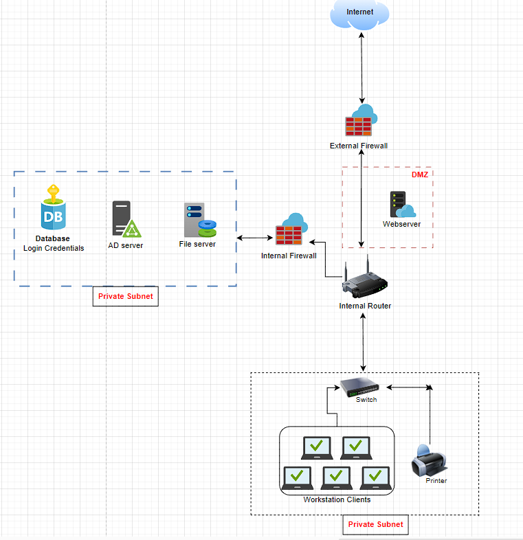

# NTW-07 - Networking case study

In this Assigment we will make a case study where we take the role of a network administrator setting up a network in the office of a small e-commerce company.

## Key-terms

- [x] <strong>Firewall</strong> -> A network security system that monitors and filters incoming and outgoing network traffic based on the perimeters that it's configured with.
- [x] <strong>DMZ</strong> (Demilitarized zone) -> A perimeter network that protects and adds an extra layer of security to an organization's internal local-area network from untrusted traffic.
- [x] <strong>AD</strong> (Active Directory) -> is a service comprising a database and executable code. It is responsible for managing requests and maintaining the database
- [x] <strong>Database</strong> -> a structured set of data held in a computer, especially one that is accessible in various ways.
- [x] <strong>Web server</strong> -> A computer system capable of delivering web content to end users over the internet via a web browser

## Requirements

- [x] https://app.diagrams.net/

## Tasks

- [x] **Design a network architecture for an office of a small e-commerce company with the following conditions:**

The office must contain the following devices:
- A web server where our webshop is hosted
- A database with login credentials for users on the webshop
- 5 workstations for the office workers
- A printer
- An AD server
- A file server containing internal documents

Design must have additional focus on network security.

- [x] Explain your design decisions

### Sources used

| Bron        | Beschrijving |
| ----------- | ----------- |
| https://medium.com/@nakah_/recommended-design-for-a-secure-network-architecture-15612e17ece4 | Article on secure network design|
| https://www.fortinet.com/resources/cyberglossary/what-is-dmz | Article on DMZ networks |

### Problems experienced

None.

### Design Decisions Explained

For this case study I made a network architecture design for a small e-commerce company.

Explanation for my design decisions:

I decided that for a small company most elements should be located in the office for a more robust and secure network environment. More so because the company states that security is very important to them. 

- The database, AD-server and File-server are placed in a private subnet within the local area network (LAN) protected with a internal Firewall configuration set on the Router.

- The workstations and printer are placed in a private subnet connected to a switch that have internet access through the Router. 

- The webserver is inside a DMZ. Adding a DMZ to the design makes sure that network traffic coming from outside the internal network is compromised from accessing the internal network of the company.

### Network Architecture Design 

