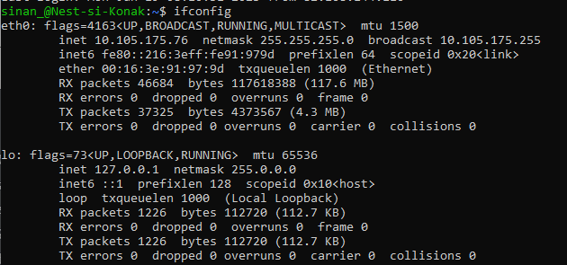
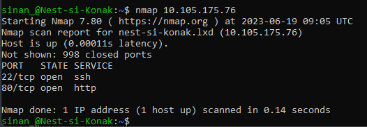
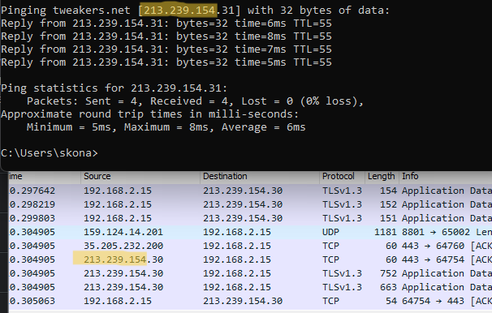
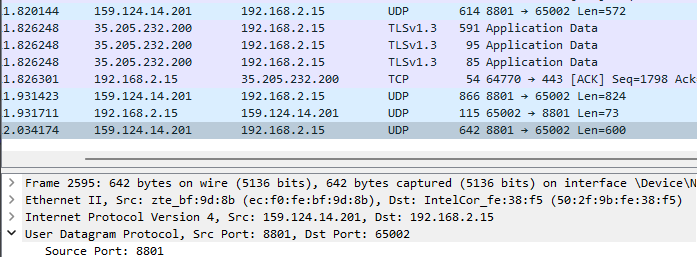

# SEC-01 - Network Detection

In this Assigment we will take a deeper dive into the concept of detecting and analyzing a network with the aid of tools like 'Network Mapper' and Wireshark.

In order to prevent or stop attacks on a network, you must be able to analyse your network. 
Analyzing network data using tools like Nmap and Wireshark provides valuable insights into the functioning and security of a network. 


## Key-terms

- [x] <strong>Nmap</strong> (Network Mapper) -> A network scanner to discover hosts and services on a computer network by sending packets and analyzing the responses.
- [x] <strong>Packets</strong> -> Packets in networking are units of data that contain information, such as source and destination addresses, used for communication between devices over a network.
- [x] <strong>Wireshark</strong> -> An open source tool for profiling network traffic and analyzing packets.


## Requirements

- [x] Wireshark
- [x] Your linux machine


## Tasks

- [x] Scan the network of your Linux machine using nmap. What do you find?
- [x] Open Wireshark in Windows/MacOS Machine. Analyse what happens when you open an internet browser. 


### Sources used

| Bron        | Beschrijving |
| ----------- | ----------- |
| https://www.freecodecamp.org/news/what-is-nmap-and-how-to-use-it-a-tutorial-for-the-greatest-scanning-tool-of-all-time/ | Article on setting up and using nmap|
| https://www.varonis.com/blog/how-to-use-wireshark | Wireshark comprehensive article |


### Problems experienced

None.


### Result(s)

*Below you will find the images showing the results along with their descriptions*

The analyse the network on the remote linux machine, we first have to discover the current network configuration that is set on the machine. To do that we can use the command ```ifconfig``` in linux bash:



So here we see that our Network address on this machine is ```10.105.175.76```

As **nmap** was not pre-installed on our client, we proceeded to install nmap ```sudo apt install nmap```

Once installed, we can scan the network using the ip-address provided with **ifconfig** :

   

Here we find that a report is provided with information such as the 'ports' that are in use and the corresponding network protocols. ```22/tcp open ssh``` ```80/tcp open http```

The discover what happens when opening a website on the browser we took the website *tweakers.net* for this instance. With 'Command Prompt' we can ping to the website -> ```ping tweakers.net``` This provides us the public ip-address ```213.239.154.31``` it uses to communicate with. So to confirm this, we capture some traffic with *Wireshark* to look for similar network data:



For the zoomcall we can see that the address ```159.124.14.201``` is the source. In wireshark we can see that three protocols are in use for this. Packets over **TCP** are sent from my pc to Zoom. Packets over **UDP** are sent from Zoom to us. The connection is furthermore secured with **TLSv1.2** protocol.




 


