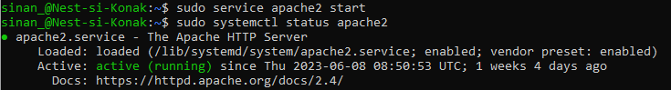
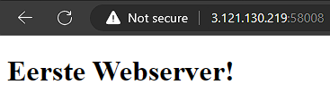
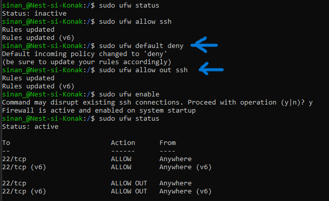
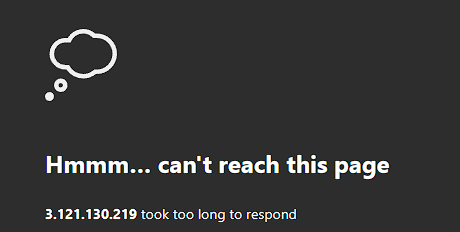

# SEC-02 - Firewalls

In this Assigment we will take a deeper dive into the concept of Firewalls.

Firewalls are an essential component of network security that act as a barrier between internal and external networks, preventing unauthorized access and protecting sensitive information. They achieve this through network filtering, controlling incoming and outgoing traffic based on predefined rules.

Firewalls can be categorized into two types: stateful and stateless. Stateless firewalls examine individual packets in isolation and make decisions based on simple rules. They lack the ability to track the state of network connections. Stateful firewalls, on the other hand, maintain awareness of the state of network connections. They analyze packet information, including the connection's context, and make decisions based on the connection's current state.

In Linux, firewalls are commonly implemented using software like iptables or firewalld. They provide a range of features to define rules for traffic filtering, allowing or denying connections based on criteria such as source/destination IP addresses, port numbers, and protocols.


## Key-terms

- [x] <strong>Firewall</strong> -> A network security system that monitors and filters incoming and outgoing network traffic based on the perimeters that it's configured with.
- [x] <strong>Stateless Firewall</strong> -> examine individual packets in isolation and make decisions based on simple rules. They lack the ability to track the state of network connections.
- [x] <strong>Stateful Firewall</strong> -> maintain awareness of the state of network connections. They analyze packet information, including the connection's context, and make decisions based on the connection's current state.
- [x] <strong>zone-based firewall</strong>is a network security system that monitor traffic and take actions based on a set of defined rules applied against incoming/outgoing packets.
- [x] <strong>firewalld</strong> (Firewall Daemon)-> A network security system that monitors and filters incoming and outgoing network traffic based on the perimeters that it's configured with.
- [x] <strong>iptables</strong> a legacy firewall program for Linux that monitors traffic from and to your server using tables that contain sets of rules.


## Requirements

- [x] Your unique port number for http-traffic
- [x] Your linux machine


## Tasks

- [x] Install a webserver on the VM
- [x] Check out the default homepage of the webserver
- [x] Configure the firewall to block web traffic, but allow ssh traffic.
- [x] Verify that the firewall is working.


### Sources used

| Bron        | Beschrijving |
| ----------- | ----------- |
| nested_list sheet | Linux VM config provided by techgrounds|
| https://www.digitalocean.com/community/tutorials/how-to-install-the-apache-web-server-on-ubuntu-20-04 | Apache webserver guide|
| https://www.digitalocean.com/community/tutorials/ufw-essentials-common-firewall-rules-and-commands | Article about ufw |


### Problems experienced

I didn't realize that a web_port was provided for this assignment and went along trying to figure out why I couldn't open the apache webpage. After some hours troubleshooting I realised I should've checked the nested_list.


### Result(s)

*Below you will find the images showing the results along with their descriptions*

On the VM, using the CLI I entered ```sudo service apache2 start``` to boot the webserver. And then checked the status of the webserver by entering ```sudo systemctl status apache2``` 



Before loading the default webpage of the webserver, I decided to change the homepage content by replacing it with *Eerste Webserver!* : ```echo '<!doctype html><html><body><h1>Eerste Webserver!</h1></body></html>' | sudo tee /var/www/html/index.html```

I also did this because I couldn't figure out why the default page wasn't loading when entering the corresponding ip-address (+ port number). *see problem experienced* Eventually I solved the issue :

   

I configured the firewall daemon *ufw* so that it blocks all web traffic but allows a SSH connection:
Before proceeding, I made sure to check whether the firewall was active -> ```ufw status``` because if active, I could exempt myself from connecting to the VM. 



To verify that the firewall is running accordingly, I reloaded the apache webpage:



