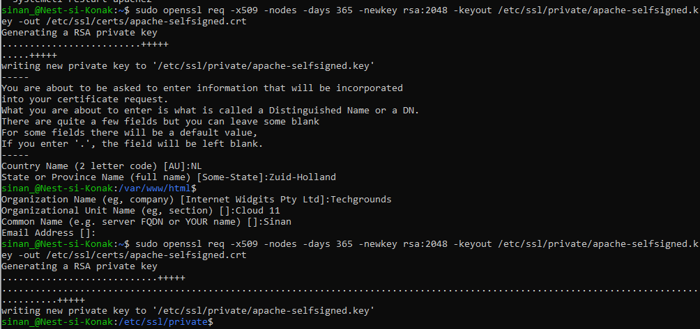
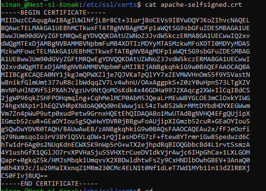
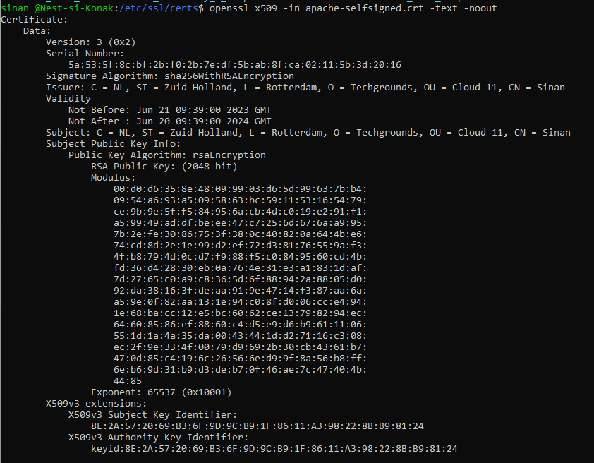
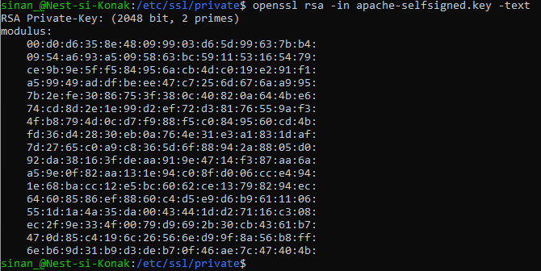
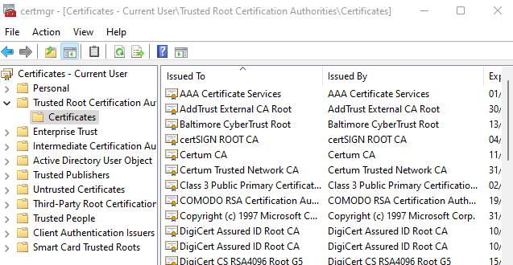
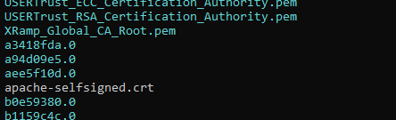

# SEC-06 - Public Key Infrastructure 

In this Assigment we will take a deeper dive into the concept of the Public Key Infrastructure (PKI).

Public Key Infrastructure (PKI) is a framework that enables secure communication and authentication in the digital world. It consists of a set of policies, technologies, and procedures that govern the management, distribution, and use of digital certificates. This framework is used to verify the authenticity of entities involved in online transactions or communication.

The framework uses asymmetric encryption -> a cryptographic technique that uses a pair of keys: a public key and a private key. The public key is widely distributed and used for encryption, while the private key is kept securely and used for decryption.

In PKI, entities such as individuals, organizations, or devices have their own key pairs. To establish trust, these entities obtain digital certificates from trusted third-party organizations called Certificate Authorities (CAs). These certificates bind the entity's public key with its identity information. CAs validate the identity of the entity before issuing the certificate.

While most certificates are issued by trusted CAs, entities can also create their own self-signed certificates. These certificates are not verified by a trusted CA but are useful for internal purposes or in specific scenarios where trust is established by other means.


## Key-terms


- [x] <strong>PKI</strong> (Public Key Infrastructure) ->  a system for the creation, storage, and distribution of digital certificates which are used to verify that a particular public key belongs to a certain entity.
- [x] <strong>Digital Certificate</strong> -> an electronic signature from one or more trusted third parties that guarantees the validity and authenticity of a public key
- [x] <strong>Electronic Signature</strong> ->  result of a third-party applying a cryptographic signature to a representation of a cryptographic key. This is usually done as a form of assurance or verification. When you sign data with a digital signature, someone else can verify the signature, and can prove that the data originated from you and was not altered after you signed it.
- [x] <strong>Web of Trust</strong>  -> a decentralized trust model for establishing trust and authenticity of the binding between a public key and its owner.
- [x] <strong>CA</strong> (Certification Authority) -> a trusted third party specialized in issuing and managing digital certificates. A CA can issue a certificate to a client directly or, as it is often the case, authorise another entity to do so, thus creating a "certification chain".
- [x] <strong>Certification Chain</strong> ->  refers to a sequence of digital certificates that are used to verify the authenticity and integrity of a particular certificate. The chain establishes a linked structure of trust starting from the end entity's certificate (also called the leaf certificate) and extending to a trusted root certificate authority (CA). Each certificate in the chain is digitally signed by the issuing CA, using the CA's private key, thereby attesting to the validity of the certificate.
- [x] <strong>X.509 standard</strong> -> widely used specification for digital certificates within a PKI framework. It defines the format and structure of certificates and specifies the information that should be included in a certificate. By following the X.509 standard, CAs can issue certificates necessary for secure communication and identification. 
- [x] <strong>Root CA</strong>  -> issues certificates to other CAs but also issues its own certificates (which are self-signed), as it sits at the top of a CA hierarchy.
- [x] <strong>Certificate Signing Request (CSR)</strong>  -> records identifying information for a person or device that owns a private key as well as information on the corresponding public key. The key owner must then sign the CSR to prove possession of that private key. Finally, the issuing CA validates the request and signs the certificate with its own private key  


## Requirements

- [x] Your Linux machine (VM)
- [x] An internet browser


## Tasks

- [x] Create a self-signed certificate on your VM.

- [x] Analyze some certification paths of known websites (ex. techgrounds.nl / google.com / ing.nl).

- [x] Find the list of trusted certificate roots on your system (bonus points if you also find it in your VM).


### Sources used

| Bron        | Beschrijving |
| ----------- | ----------- |
| https://www.enisa.europa.eu/topics/incident-response/glossary/public-key-infrastructure-pki | PKI - European Union Agency for Cybersecurity (ENISA) |
| https://en.wikipedia.org/wiki/Web_of_trust | In depth article on Web of Trust |
| https://www.keyfactor.com/blog/pki-definition-terms-to-know/ | PKI definitions and terms |
| https://ubuntu.com/server/docs/security-certificates | Documentation about Certificates in Linux |
| https://www.digitalocean.com/community/tutorials/how-to-create-a-self-signed-ssl-certificate-for-apache-in-ubuntu-16-04 | article on creating ssl certificate in ubuntu |


### Problems experienced

None.


### Result(s)

*Below you will find the images showing the results along with their descriptions*

To create a self-signed certificate on on my VM I followed the steps stated below:
- I generated a self-signed key with ```openssl``` by entering the following command:
```
sudo openssl req -x509 -nodes -days 365 -newkey rsa:2048 -keyout /etc/ssl/private/apache-selfsigned.key -out /etc/ssl/certs/apache-selfsigned.crt
```
To elaborate this command: 
```
req 	-> specifies that I want to use the X.509 standard for creating a certificate 
-x509 	-> This tells that I want to make a self-signed certificate (so no csr)
-nodes	-> No passphrase for the certificate
-days 365 		-> validity length
-newkey rsa:2048 	-> Generates a new key + certificate at the same time. RSA key 2048bits long
-keyout	-> location to place the key file
-out	-> location to place the certificate 
```
- Afterwards a prompt follows for entering information about the webpage that the certificate is used for.



To view the contents of the certificate scrambled :



Certificate Detailed (text):



Contents of private *.key* file
  


-------------------------------------

*For the second task I will elaborate my analysis of the certification path of 'techgrounds.nl'*

->Techgrounds<-

By clicking on the security lock next to the address bar we can discover the certificate path:
```
Certificate Signature Algorithm : 
PKCS #1 SHA-256 With RSA (2048) Encryption 


Authority Information access OCSP:

Responder: URI: http://r3.o.lencr.org
CA Issuers: URI: http://r3.i.lencr.org/

Issued by: 'Let's Encrypt'
```

---------------------------------

To find the list of trusted certificate roots on my system (Windows) I took the following steps:

- Launch the certification manager -> Windows-key + R -> enter "certmgr.msc"
- In the certification manager window -> expand the 'Trusted Root Certification Authorities' folder.
- Inside I found the list.



To find the list of trusted certificate roots on my VM I took the following steps:

With the first I already discovered the directory to where all the certificate files are listed:

Go to directory -> ```cd /etc/ssl/certs``` and there you are.




